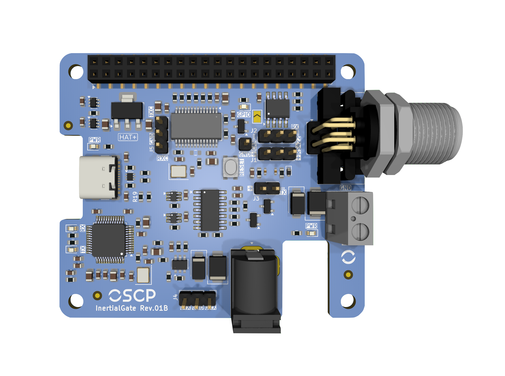
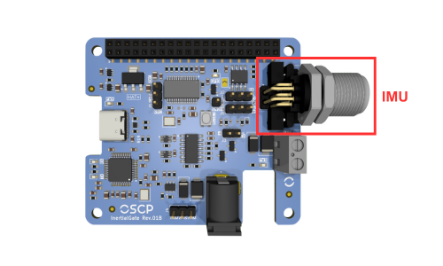
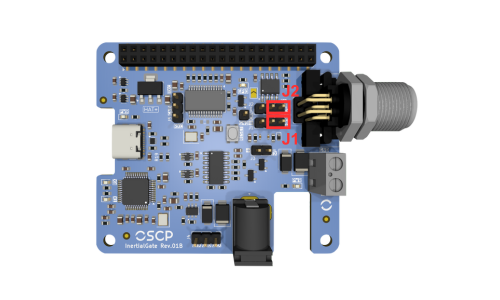
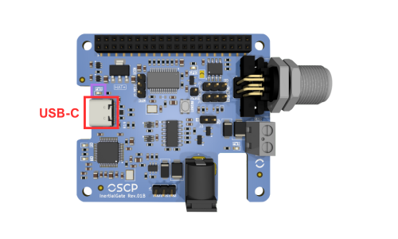
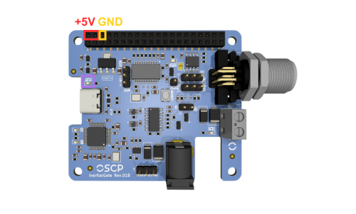
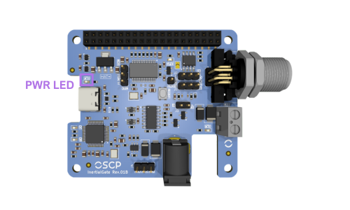
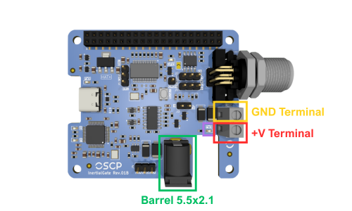
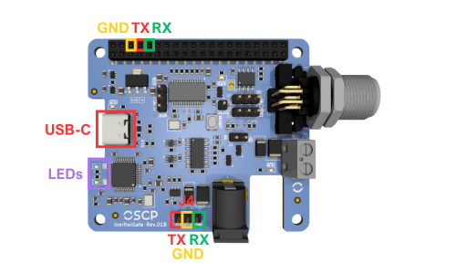
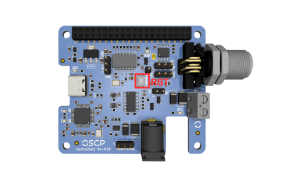

# InertialGate

## 1. Features 
 - Support RS422 and CAN-FD variants
 - USB-C virtual COM port with RS422
 - Raspberry Pi HAT+ compatibility
 - Headers for multi-platform integration
 - Compact "57x66 mm" design with M3 holes

## 2. Description 
InertialGate is a versatile IMU interface board designed for easy integration of OSCP Inertial Systems across multiple platforms. It can be used as an Evaluation Kit for our Inertial Systems. 

<figure markdown="span">
  { align=left width=400 }
  <figcaption>Figure 1: OSCP-InertialGate Illustration</figcaption>
</figure>

## 3. Initial Setup
InertialGate can be used in two common ways. The first is as a standalone unit, either connected directly to a laptop via USB-C or integrated into a custom platform. The second option is to use InertialGate as a Raspberry Pi HAT+, stacking it directly on top of a Raspberry Pi for a compact setup. Both configurations are described in the following subsections.

### 3.1. Standalone 
In standalone mode, no initial setup is required for InertialGate. Simply connect the IMU to the board using the supplied cable: one end plugs into the receptacle shown in Figure 2 below, and the other end connects directly to the IMU.
<figure markdown="span">
  { align=left }
  <figcaption>Figure 2: IMU Connection Receptacle on InertialGate (Standalone Mode)</figcaption>
</figure>

### 3.2. Rasberry Pi 
InertialGate is fully compatible with the Raspberry Pi HAT+ specification and can be stacked directly on top of any Raspberry Pi equipped with a standard 40-pin GPIO header. The board includes an onboard EEPROM pre-programmed according to the HAT+ specification, allowing the operating system to automatically identify the board upon boot. To verify that InertialGate is correctly detected, run the following command:

```bash
cat /proc/device-tree/hat/product
```
If the board is properly recognized, this command returns the product name InertialGate. No manual device tree configuration is required for the identification step. 

Once physically installed and detected, additional driver overlays must be configured in `/boot/firmware/config.txt` to enable **UART** or **CAN-FD** communication. Refer to [Section 7.1.2](#71240-pin-header) and [Section 7.2.1](#72140-pin-header) for the complete setup instructions for each respective variant.

## 4. IMU Protocol Configuration
InertialGate must be configured to route the appropriate communication signal to the rest of the system. Jumpers **J1** and **J2** are used to switch between RS422 and CAN-FD protocols. The following subsections illustrate the correct jumper placement for each protocol.

### 4.1. RS422 IMU Variant
To configure InertialGate for an **RS422** IMU, place jumpers **J1** and **J2** in the **right** positions, next to the IMU connector, where the silkscreen is labeled RS422, as shown in Figure 3.
<figure markdown="span">
  { align=left }
  <figcaption>Figure 3: Jumper Positions for RS422 Configuration (Right Side)</figcaption>
</figure>

### 4.2. CAN-FD IMU Variant
To configure InertialGate for a **CAN-FD** IMU, place jumpers **J1** and **J2** in the **left** positions, far from the IMU connector, where the silkscreen is labeled CAN, as shown in Figure 4.
<figure markdown="span">
  { align=left }
  <figcaption>Figure 4: Jumper Positions for CAN-FD Configuration (Left Side)</figcaption>
</figure>

## 5. Powering InertialGate

InertialGate requires a +5V power supply for proper operation. Power can be provided either through the USB-C port, used for RS422 data communication, or via the 40-pin header, which is used in standalone or when InertialGate is stacked on a Raspberry Pi.

### 5.1. Via USB-C
The simplest way to power InertialGate is through the USB-C port on the left, highlighted in Figure 5 below. The onboard circuitry will automatically negotiate a +5V supply, and the **PWR LED** above the port will illuminate to indicate that the board is powered.

<figure markdown="span">
  { align=left }
  <figcaption>Figure 5: USB-C Power Port and PWR LED on InertialGate</figcaption>
</figure>

### 5.2. Via 40-Pin Header
Another way to provide  +5V to InertialGate is via the 40-pin header. Following the RPi pinout specs, use jumper wires to supply  +5V to one of the two top-left pins of the header, with GND connected to the third pin immediately after the second 5V pin. The **PWR LED** will also illuminate to indicate that the board is powered, as shown in Figure 6 below.

<figure markdown="span">
  { align=left }
  <figcaption>Figure 6: 40-Pin Header Power Connections on InertialGate</figcaption>
</figure>

### 5.3. Via Raspberry Pi
When InertialGate is stacked directly on a Raspberry Pi as a HAT+, the RPi supplies +5V to InertialGate through the 40-pin GPIO header, following the HAT+ standard. No additional wiring or dedicated power supply is required for the InertialGate board itself.

In this configuration, the Raspberry Pi must be powered by a suitable adapter capable of supplying sufficient current for both the RPi and InertialGate. The **PWR LED** on InertialGate will illuminate once the board is receiving +5V from the header.

<figure markdown="span">
  { align=left }
  <figcaption>Figure 7: PWR LED on InertialGate</figcaption>
</figure>

!!! warning  "One Single Power Supply At A Time"

    Do not power InertialGate via its USB-C port [(Section 5.1)](#51via-usb-c) simultaneously while it is stacked on a Raspberry Pi. Use only one power source at a time.

## 6. Powering an OSCP IMU
To power an IMU connected to InertialGate (see [Section 3](#3initial-setup)), two options are available. The first is using a +12V to +34V barrel connector (5.5 × 2.1 mm - _**center positive and outer negative**_). The second is using the screw terminal block located next to the IMU connector, which also accepts +12V to +34V. **Do not use both options simultaneously.** 

!!! warning  "Screw Terminal Block Polarity"

    When using the terminal block, observe the correct polarity: "GND" is closer to the IMU connector, and +V is toward the bottom of the board. The silkscreen markings make the correct orientation clear. Figure 8 also illustrates the proper polarity.

The **IMU PWR LED** will illuminate when either power option is used.

<figure markdown="span">
  { align=left }
  <figcaption>Figure 8: Power Connections for OSCP IMU on InertialGate (+12 V to +34 V, Correct Polarity</figcaption>
</figure>

## 7. Accessing Data

The following subsections describe the available options for gathering data from InertialGate for both RS422 and CAN-FD variants.

### 7.1. RS422 Variant
With jumpers set to RS422 (see [Section 4.1](#41rs422-imu-variant)), InertialGate translates RS422 to **UART**, simplifying integration with other subsystems. Three options are available to access the data.

#### 7.1.1. USB-C Connection
The simplest method is to connect InertialGate directly to a laptop via the USB-C port. The board is recognized as a **Virtual COM Port** through its integrated _FTDI FT232HL_ chip. On Windows, it typically appears as `COMX`, on macOS, it appears under `/dev/tty.X` and on Linux, it often appears as `/dev/ttyUSBX`. The RX/TX LEDs are located on the bottom-left corner of the board, providing visual indication of UART data transmission and reception.

#### 7.1.2. 40-Pin Header 
Data can also be accessed via the 40-pin female header through jumper wires. This is used in standalone setups or when InertialGate is stacked on a Raspberry Pi. Pinout details are shown in Figure 9, where GND is the third pin from the top left, TX the fourth, RX the fifth.

When stacked on a RPi, the UART0 peripheral is used and must be enabled by adding the following overlay to `/boot/firmware/config.txt`:
```bash
dtoverlay=uart0
```
After saving and rebooting, the IMU data stream will be available on `/dev/ttyAMA0`.

#### 7.1.3. Direct UART Pins
Three male headers (**J4**) provide access to TX, RX and GND signals at the bottom of InertialGate. This allows connection to a custom system. Figure 9 shows the pinout details.

<figure markdown="span">
  { align=left }
  <figcaption>Figure 9: RS422 Data Access Options and Pinout on InertialGate</figcaption>
</figure>

### 7.2. CAN-FD Variant
!!! info  "Next Revision of the User Manual"

    This section refers will be refined in the next revision of the User Manual.

#### 7.2.1. 40-Pin Header
#### 7.2.2. Direct CAN Pins

## 8. Reset an OSCP IMU
The reset button on InertialGate is directly connected to the IMU’s hardware reset pin and can be used to restart the unit whenever needed. Pressing this button issues a hardware reset. Figure 10 below shows the exact location of the reset button on the board.

<figure markdown="span">
  { align=left }
  <figcaption>Figure 10: Location of the IMU Reset Button on InertialGate</figcaption>
</figure>

## 9. 3D-Printed ABS Enclosure
InertialGate is delivered with a 3D-printed ABS enclosure. This enclosure is provided primarily for mechanical protection and ease of handling, especially when the device is used in an unmounted or bench-top setup.

The enclosure uses a clip-based retention mechanism and can be removed easily without tools. To remove it, press simultaneously on both sides of the white area of the enclosure, specifically at the front of the unit near the connector, and gently pull the enclosure away from the board.

Once the enclosure is removed, InertialGate can be used as a standard OEM board. In this configuration, it may be mounted in any orientation or location that best suits the integration requirements of the target system.