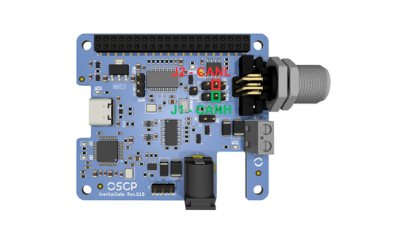

# InertialGate

!!! info "Revision"
    This documentation tracks **REV03** (2026-04-06) and is preliminary — content is
    subject to change without notice. See the [changelog](changelog.md) for revision
    history.

<div class="grid" markdown>

<div markdown>
InertialGate is a versatile IMU interface board designed for easy integration of OSCP
Inertial Systems across multiple platforms. It can be used as an Evaluation Kit for our
Inertial Systems.

It handles both RS422 and CAN-FD units, stacks on a Raspberry Pi as a HAT+ or runs
standalone, and exposes the data stream over USB-C, the 40-pin header, or direct pin
headers.

</div>

{ .fit .transparent }

</div>

---

## 1. Features

<div class="grid cards" markdown>

-   :material-connection: __Protocol variants__

    Supports RS422 and CAN-FD

-   :material-usb-c-port: __USB-C virtual COM port__

    Support for RS422 variants

-   :material-raspberry-pi: __Raspberry Pi HAT+__

    Stacks directly on a 40-pin GPIO header

-   :material-pin-outline: __Headers__

    For multi-platform integration

-   :material-cube-outline: __Dimensions__

    57 × 66 mm · M3 mounting holes

</div>

---

## 2. Initial Setup
InertialGate can be used in two common ways. The first is as a standalone unit, either connected directly to a laptop via USB-C or integrated into a custom platform. The second option is to use InertialGate as a Raspberry Pi HAT+, stacking it directly on top of a Raspberry Pi for a compact setup. Both configurations are described in the following subsections.

### 2.1. Standalone 
In standalone mode, no initial setup is required for InertialGate. Simply connect the IMU to the board using the supplied cable: one end plugs into the receptacle shown below, and the other end connects directly to the IMU.
<figure markdown="span">
  
</figure>

### 2.2. Raspberry Pi 
InertialGate is fully compatible with the Raspberry Pi HAT+ specification and can be stacked directly on top of any Raspberry Pi equipped with a standard 40-pin GPIO header. The board includes an onboard EEPROM pre-programmed according to the HAT+ specification, allowing the operating system to automatically identify the board upon boot. To verify that InertialGate is correctly detected, run the following command:

```bash
cat /proc/device-tree/hat/product
```
If the board is properly recognized, this command returns the product name InertialGate. No manual device tree configuration is required for the identification step. 

Once physically installed and detected, additional driver overlays must be configured in `/boot/firmware/config.txt` to enable **UART** or **CAN-FD** communication. Refer to [Section 6.1.2](#612-40-pin-header) and [Section 6.2.1](#621-40-pin-header) for the complete setup instructions for each respective variant.

---

## 3. IMU Protocol Configuration
InertialGate must be configured to route the appropriate communication signal to the rest of the system. Jumpers **J1** and **J2** are used to switch between RS422 and CAN-FD protocols. The following subsections illustrate the correct jumper placement for each protocol.

### 3.1. RS422 IMU Variant
To configure InertialGate for an **RS422** IMU, place jumpers **J1** and **J2** in the **right** positions, next to the IMU connector, where the silkscreen is labeled RS422, as shown below.
<figure markdown="span">
  
</figure>

### 3.2. CAN-FD IMU Variant
To configure InertialGate for a **CAN-FD** IMU, place jumpers **J1** and **J2** in the **left** positions, far from the IMU connector, where the silkscreen is labeled CAN, as shown below.
<figure markdown="span">
  
</figure>

---

## 4. Powering InertialGate

InertialGate requires a +5V power supply for proper operation. Power can be provided either through the USB-C port, used for RS422 data communication, or via the 40-pin header, which is used in standalone or when InertialGate is stacked on a Raspberry Pi.

### 4.1. Via USB-C
The simplest way to power InertialGate is through the USB-C port on the left, highlighted below. The onboard circuitry will automatically negotiate a +5V supply, and the **PWR LED** above the port will illuminate to indicate that the board is powered.

<figure markdown="span">
  
</figure>

### 4.2. Via 40-Pin Header
Another way to provide  +5V to InertialGate is via the 40-pin header. Following the RPi pinout specs, use jumper wires to supply  +5V to one of the two top-left pins of the header, with GND connected to the third pin immediately after the second 5V pin. The **PWR LED** will also illuminate to indicate that the board is powered, as shown below.

<figure markdown="span">
  
</figure>

### 4.3. Via Raspberry Pi
When InertialGate is stacked directly on a Raspberry Pi as a HAT+, the RPi supplies +5V to InertialGate through the 40-pin GPIO header, following the HAT+ standard. No additional wiring or dedicated power supply is required for the InertialGate board itself.

In this configuration, the Raspberry Pi must be powered by a suitable adapter capable of supplying sufficient current for both the RPi and InertialGate. The **PWR LED** on InertialGate will illuminate once the board is receiving +5V from the header.

<figure markdown="span">
  
</figure>

!!! warning  "One Single Power Supply At A Time"

    Do not power InertialGate via its USB-C port [(Section 4.1)](#41-via-usb-c) simultaneously while it is stacked on a Raspberry Pi. Use only one power source at a time.

---

## 5. Powering an OSCP IMU
To power an IMU connected to InertialGate (see [Section 2](#2-initial-setup)), two options are available. The first is using a +12V to +34V barrel connector (5.5 × 2.1 mm - _**center positive and outer negative**_). The second is using the screw terminal block located next to the IMU connector, which also accepts +12V to +34V. **Do not use both options simultaneously.** 

!!! warning  "Screw Terminal Block Polarity"

    When using the terminal block, observe the correct polarity: "GND" is closer to the IMU connector, and +V is toward the bottom of the board. The silkscreen markings make the correct orientation clear, as illustrated below.

The **IMU PWR LED** will illuminate when either power option is used.

<figure markdown="span">
  
</figure>

---

## 6. Accessing Data

The following subsections describe the available options for gathering data from InertialGate for both RS422 and CAN-FD variants.

### 6.1. RS422 Variant
With jumpers set to RS422 (see [Section 3.1](#31-rs422-imu-variant)), InertialGate translates RS422 to **UART**, simplifying integration with other subsystems. Three options are available to access the data.

#### 6.1.1. USB-C Connection
The simplest method is to connect InertialGate directly to a laptop via the USB-C port. The board is recognized as a **Virtual COM Port** through its integrated _FTDI FT232HL_ chip. On Windows, it typically appears as `COMX`, on macOS, it appears under `/dev/tty.X` and on Linux, it often appears as `/dev/ttyUSBX`. The RX/TX LEDs are located on the bottom-left corner of the board, providing visual indication of UART data transmission and reception.

#### 6.1.2. 40-Pin Header 
Data can also be accessed via the 40-pin female header through jumper wires. This is used in standalone setups or when InertialGate is stacked on a Raspberry Pi. Pinout details are shown below, where GND is the third pin from the top left, TX the fourth, RX the fifth.

When stacked on a RPi, the UART0 peripheral is used and must be enabled by adding the following overlay to `/boot/firmware/config.txt`:

```bash
dtoverlay=uart0
```
After saving and rebooting, the IMU data stream will be available on `/dev/ttyAMA0`.

<figure markdown="span">
  
</figure>

#### 6.1.3. Direct UART Pins
Three male headers (**J4**) provide access to TX, RX and GND signals at the bottom of InertialGate in standalone mode. This allows connection to a custom system, using the pinout shown above. Power cannot be provided via USB-C for this configuration, without custom tweaks.

!!! warning "TX and RX Are Named From the Host Point of View"

    The **TX** and **RX** labels follow the point of view of the host system, not of
    InertialGate. The lines must therefore be wired **straight through, not crossed**:

    | J4 pin | Signal direction | Connect to |
    | ------ | ---------------- | ---------- |
    | TX | Input to InertialGate, carries data toward the IMU | TX of the custom system |
    | RX | Output from InertialGate, carries the IMU data stream | RX of the custom system |
    | GND | — | GND of the custom system |

### 6.2. CAN-FD Variant

With jumpers set to CAN-FD (see [Section 3.2](#32-can-fd-imu-variant)), the differential
pair coming from the IMU connector is routed to the onboard **MCP251863** CAN-FD
controller and transceiver. The controller is clocked by a dedicated 20 MHz crystal and
communicates with the host over **SPI**, which means that on the CAN-FD variant
InertialGate acts as a CAN-FD-to-SPI bridge rather than as a passive level translator.
 
Two options are available to access the data: through the 40-pin header (SPI, typically
with InertialGate stacked on a Raspberry Pi), or by tapping the differential bus itself at
the protocol-selection jumpers, which lets the IMU join an existing CAN-FD network. A third header is provided for debugging only.

!!! info "No Data Over USB-C On CAN-FD Units"
 
    The USB-C port and its _FTDI FT232HL_ virtual COM port only serve the RS422 signal
    path. On a CAN-FD unit, USB-C can still be used to power the board
    [(Section 4.1)](#41-via-usb-c), but the IMU data stream is **not** available on the
    virtual COM port.
 
The signals used by the CAN-FD path are summarized below.
 
| MCP251863 signal | Raspberry Pi GPIO | 40-pin header |
| ---------------- | ----------------- | ------------- |
| SCK              | GPIO11 (SPI0 SCLK) | 23           |
| SDI              | GPIO10 (SPI0 MOSI) | 19           |
| SDO              | GPIO9 (SPI0 MISO)  | 21           |
| nCS              | GPIO8 (SPI0 CE0)   | 24           |
| nINT             | GPIO17             | 11           |
| nINT1            | GPIO27             | 13           |

#### 6.2.1. 40-Pin Header

When InertialGate is stacked on a Raspberry Pi (or wired to one through the 40-pin female
header), the CAN-FD controller is reached over SPI0 with chip select CE0. The kernel driver
`mcp251xfd` is used; it is included in Raspberry Pi OS and only needs to be instantiated
through a device tree overlay.
 
Add the following line to `/boot/firmware/config.txt`:
 
```bash
dtoverlay=mcp251xfd,spi0-0,oscillator=20000000,speed=20000000,interrupt=17,rx_interrupt=27
```
 
The parameters map directly to the hardware:
 
- `spi0-0` — SPI0, chip select 0, as wired on the board.
- `oscillator=20000000` — the 20 MHz crystal dedicated to the CAN controller.
- `speed=20000000` — SPI clock, 20 MHz.
- `interrupt=17` — main interrupt line (nINT) on GPIO17.
- `rx_interrupt=27` — receive interrupt line (nINT1) on GPIO27.

Save the file and reboot. Then bring the interface up with the bit timing used by OSCP IMUs:
 
```bash
sudo ip link set can0 up type can \
    bitrate 1000000 sample-point 0.96 \
    dbitrate 1000000 dsample-point 0.52 fd on
```

The IMU data stream can then be read with the `can-utils` package:
 
```bash
sudo apt install can-utils
candump can0
```

To reconfigure the interface, bring it down first with
`sudo ip link set can0 down`.
 
!!! tip "Persisting The Interface Configuration"
 
    The `ip link` command does not survive a reboot. On a permanent installation, the
    interface should be configured through the network management stack of the host
    distribution (for example a `systemd-networkd` link file) so that `can0` is brought up
    automatically at boot.

#### 6.2.2. Connecting To An External CAN Bus
 
InertialGate can also be inserted into an existing CAN-FD network, so that the IMU is read
by a vehicle bus or by any external CAN-FD node rather than by the onboard controller.
 
The differential pair coming from the IMU is available on the **centre pin** of the
protocol-selection jumpers described in [Section 3](#3-imu-protocol-configuration):
 
| Signal | Access point |
| ------ | ------------ |
| CANH   | Centre pin of **J1** |
| CANL   | Centre pin of **J2** |
 
<figure markdown="span">
  
</figure>
 
**Jumpers installed in the CAN position.** The IMU, the onboard MCP251863 and the external
network all share the same bus. The Raspberry Pi can keep reading the IMU through
[Section 6.2.1](#621-40-pin-header) while the external node receives the same traffic. The
onboard termination remains connected, so InertialGate acts as one terminated end of the
bus.
 
**Jumpers removed.** The IMU pair is isolated from the onboard transceiver and is carried
straight from the two centre pins to the external network. The onboard controller is no
longer on the bus, and the onboard termination is out of circuit.
 
!!! warning "Bus Termination"
 
    InertialGate implements a split termination network on the transceiver side of J1 and
    J2. With the jumpers installed, the board terminates one end of the bus. With the jumpers
    removed, InertialGate provides no termination at all.
 
#### 6.2.3. Debug Header
 
Header **J5** exposes the TXD and RXD lines running between the MCP2518FD controller and
its transceiver. It is provided only for observing traffic during integration and debugging,
for example with a logic analyzer.
 
---

## 7. Reset an OSCP IMU
The reset button on InertialGate is directly connected to the IMU's hardware reset pin and can be used to restart the unit whenever needed. Pressing this button issues a hardware reset. The figure below shows the exact location of the reset button on the board.

<figure markdown="span">
  
</figure>

---

## 8. 3D-Printed ABS Enclosure
InertialGate is delivered with a 3D-printed ABS enclosure. This enclosure is provided primarily for mechanical protection and ease of handling, especially when the device is used in an unmounted or bench-top setup.

The enclosure uses a clip-based retention mechanism and can be removed easily without tools. To remove it, press simultaneously on both sides of the white area of the enclosure, specifically at the front of the unit near the connector, and gently pull the enclosure away from the board.

Once the enclosure is removed, InertialGate can be used as a standard OEM board. In this configuration, it may be mounted in any orientation or location that best suits the integration requirements of the target system.
