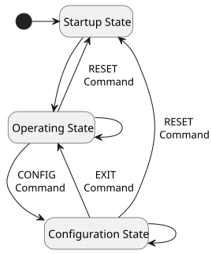

# Data & Frames

!!! tip "Basic Operation"

    Each OSCP-MK2 IMU is easy to operate. The unit will start performing 11-DoF measurements and transmit Operating Frames on the output interface, with no additional configuration required after power-up.

The IMU can operate in 3 different Operating Modes: **Idle** (*I*), **Low** (*L*), **Medium** (*M*) Speed. Each mode is described in the table below; these figures are identical across the MK2 family.

<table markdown="1" class="oscp-table">
<caption><strong>Table: Details of the MK2 IMU Family Operating Modes</strong></caption>
<colgroup>
<col style="width:65%">
<col style="width:15%">
<col style="width:15%">
<col style="width:15%">
</colgroup>
<thead>
<tr><th>Features</th><th>Idle</th><th>Low</th><th>Medium</th></tr>
</thead>
<tbody>

<tr><td class="text-left">Startup Frame Length</td><td colspan="3">40 bytes</td></tr>
<tr><td class="text-left">Raw Operating Frame Length</td><td colspan="3">61 bytes</td></tr>
<tr><td class="text-left">Euler (AHRS) Operating Frame Length</td><td colspan="3">25 bytes</td></tr>
<tr><td class="text-left">Quaternion (AHRS) Operating Frame Length</td><td colspan="3">29 bytes</td></tr>
<tr><td class="text-left">Rot. Matrix (AHRS) Operating Frame Length</td><td colspan="3">49 bytes</td></tr>
<tr><td class="text-left">GNSS Operating Frame Length</td><td colspan="3">64 bytes</td></tr>
<tr><td class="text-left">Debug (User Configuration) Frames 1 &amp; 2 Length</td><td colspan="3">58 bytes</td></tr>

<tr><td class="text-left">Raw Operating Frame <strong>Output</strong> Data Rate</td><td>0 Hz</td><td>100 Hz</td><td>500 Hz</td></tr>
<tr><td class="text-left">AHRS Operating Frame <strong>Output</strong> Data Rate</td><td>0 Hz</td><td colspan="2">100 Hz</td></tr>
<tr><td class="text-left">GNSS Operating Frame <strong>Output</strong> Data Rate</td><td>0 Hz</td><td colspan="2">1 Hz</td></tr>

<tr><td class="text-left">Gyroscope <strong>Update</strong> Data Rate</td><td>10 Hz</td><td>100 Hz</td><td>500 Hz</td></tr>
<tr><td class="text-left">Accelerometer <strong>Update</strong> Data Rate</td><td>10 Hz</td><td>100 Hz</td><td>500 Hz</td></tr>
<tr><td class="text-left">Magnetometer <strong>Update</strong> Data Rate</td><td>10 Hz</td><td>100 Hz</td><td>100 Hz</td></tr>
<tr><td class="text-left">Inclinometer <strong>Update</strong> Data Rate</td><td>10 Hz</td><td>100 Hz</td><td>500 Hz</td></tr>
<tr><td class="text-left">Temperature <strong>Update</strong> Data Rate</td><td colspan="3">4 Hz</td></tr>
<tr><td class="text-left">GNSS <strong>Update</strong> Data Rate</td><td colspan="3">1 Hz</td></tr>

</tbody>
</table>

## Output Protocol Specifications

The unit is available in two hardware configurations, supporting either RS422 or CAN-FD as the output protocol, referred to as variants. This is independent of the MK2M2 / MK2E2 model — each model is offered in both variants.

=== "RS422 Variant"

    The RS422 interface operates at **921600 baud**, **8 data bits**, **no parity**, **1 stop bit** (8N1).

    !!! info "COBS Decoding & Encoding for the RS422 Variant"
        All communication with the IMU in the RS422 variant uses *COBS* (**Consistent Overhead Byte Stuffing**) encoding. It is mandatory to use this encoding for any data exchanged with the unit. This is not the case for the CAN-FD variant.

        Please refer to [RS422 Frame Decoding & Encoding — COBS](#rs422-frame-decoding-encoding-cobs-consistent-overhead-byte-stuffing) below for decoding and encoding details, including guidance for C-based and Python-based platforms.


=== "CAN-FD Variant"

    The CAN-FD (Flexible Data-Rate) variant offers the following specifications:

    - **Arbitration bitrate:** 1 Mbps
    - **Data bitrate:** 1 Mbps
    - **Sample-point:** 0.96
    - **Data sample-point:** 0.52
    - **Extended frame length:** up to 64 bytes per frame

    The following CAN identifiers are used by the IMU to exchange data:

    - **CAN Message IDs:** 0x6F0 to 0x6FF
        - *0x6F0*: Raw Operating Frame
        - *0x6F1*: Euler Angles Operating Frame
        - *0x6F2*: Quaternion Operating Frame
        - *0x6F3*: Rotation Matrix Operating Frame
        - *0x6F4*: GNSS Operating Frame
        - *0x6F5*: Debug Frame 1
        - *0x6F6*: Debug Frame 2
        - *0x6F7*: Startup Frame
        - *0x6FC*: Command from the User
        - *0x6FD*: ASCII Response from the IMU

    !!! info "Setup for Linux-based systems"
        For Linux-based systems, the *can0* interface can be configured with the following:

        ```
        sudo ip link set can0 up type can bitrate 1000000 sample-point 0.96 dbitrate 1000000 dsample-point 0.52 fd on
        ```

    !!! info "Details for CAN-FD in Python"
        In Python, the [python-can](https://pypi.org/project/python-can/) package provides support for CAN-FD. As an example using OSCP InertialGate, the interface *slcan* can be used.


## State Diagram

{ .svg .padded .narrow }

## Startup Frame
 
After startup, the first frame sent by the IMU is a **40-byte** startup frame. It contains its current configuration, and can also be requested with a startup frame command when the IMU is in configuration state (see [Get a Startup Frame](commands.md#get-a-startup-frame)). The description is given in the table below.
 
<table markdown="1" id="startup-frame-table" class="oscp-table">
<caption><strong>Table: Full Description of a Startup Frame (S - <em>0b111</em>)</strong></caption>
<colgroup>
<col style="width:12%">
<col style="width:56%">
<col style="width:32%">
</colgroup>
<thead>
<tr><th>Byte #</th><th>Description</th><th>Format</th></tr>
</thead>
<tbody>
<tr>
<td>0</td>
<td>Misalignment Correction [7:6]<br>Operating Mode [5:3]<br>Frame Type [2:0] = 0b111</td>
<td>See <a href="#misalignment-correction">Misalignment Correction</a><br>See <a href="#operating-mode">Operating Mode</a><br>See <a href="#frame-type">Frame Type</a></td>
</tr>
<tr><td>1 - 10</td><td class="text-center">Mark Number — fixed depending on model</td><td>ASCII</td></tr>
<tr><td>11 - 12</td><td>Unit Number</td><td>16-bit unsigned integer</td></tr>
<tr><td>13</td><td>Software Major Version</td><td>8-bit unsigned integer</td></tr>
<tr><td>14</td><td>Software Minor Version</td><td>8-bit unsigned integer</td></tr>
<tr><td>15</td><td>Software Patch Version</td><td>8-bit unsigned integer</td></tr>
<tr><td>16</td><td>Enabled Frame Types</td><td>See <a href="#enabled-frame-types">Enabled Frame Types</a></td></tr>
<tr>
<td>17</td>
<td>Accelerometer Dynamic Range [7:4]<br>Gyroscope Dynamic Range [3:0]</td>
<td>See <a href="#accelerometer-dynamic-range">Accelerometer Dynamic Range</a><br>See <a href="#gyroscope-dynamic-range">Gyroscope Dynamic Range</a></td>
</tr>
<tr>
<td>18</td>
<td>Gyroscope High-Pass Filter [7:5]<br>Gyroscope Low-Pass Filter [4:2]<br>Gyroscope Filters [1:0]</td>
<td>See <a href="#gyroscope-filters">Gyroscope Filters</a></td>
</tr>
<tr>
<td>19</td>
<td>Accelerometer High-Pass Filter [7:5]<br>Accelerometer Low-Pass Filter [4:2]<br>Accelerometer Filters [1:0]</td>
<td>See <a href="#accelerometer-filters">Accelerometer Filters</a></td>
</tr>
<tr>
<td>20</td>
<td>AHRS Heading Source [7:6]<br>AHRS Convention [5:4]<br>Inclinometer Dynamic Range [3:0]</td>
<td>See <a href="#ahrs-configuration">AHRS Configuration</a><br>See <a href="#ahrs-configuration">AHRS Configuration</a><br>See <a href="#inclinometer-dynamic-range">Inclinometer Dynamic Range</a></td>
</tr>
<tr><td>21 - 24</td><td>AHRS Gain</td><td>See <a href="#ahrs-configuration">AHRS Configuration</a></td></tr>
<tr><td>25 - 28</td><td>AHRS Acceleration Rejection</td><td>See <a href="#ahrs-configuration">AHRS Configuration</a></td></tr>
<tr><td>29 - 32</td><td>AHRS Magnetic Rejection</td><td>See <a href="#ahrs-configuration">AHRS Configuration</a></td></tr>
<tr><td>33 - 36</td><td>AHRS Recovery Trigger Period</td><td>See <a href="#ahrs-configuration">AHRS Configuration</a></td></tr>
<tr><td>37</td><td>Status Byte</td><td>See <a href="#status-byte">Status Byte</a></td></tr>
<tr><td>38 - 39</td><td>Cyclic Redundancy Check (CRC-16)</td><td>See <a href="#integrity-verification">Integrity Verification</a></td></tr>
</tbody>
</table>
## Operating Frames
 
Once start-up has been completed, the IMU enters its main operating state and sends, at a given output data rate, the sensor readings in a frame that can contain **61-byte** (*R*), **25-byte** (*E*), **29-byte** (*Q*) or **49-byte** (*M*) depending on the type of frame selected. Optionally, a GNSS frame of **64-byte** (*G*) can be requested as well.
 
Two **58-byte** Debug frames (*D*) are available to read back the current unit configuration.
 
### Frame Type
 
<table markdown="1" class="oscp-table">
<caption><strong>Table: Description of available Frame Types</strong></caption>
<colgroup>
<col style="width:16%">
<col style="width:60%">
<col style="width:24%">
</colgroup>
<thead>
<tr><th>Frame Type</th><th>Description</th><th>Binary</th></tr>
</thead>
<tbody>
<tr><td><em>R</em></td><td>Raw Operating Frame</td><td><code>0b000</code></td></tr>
<tr><td><em>E</em></td><td>Euler Angles Operating Frame</td><td><code>0b001</code></td></tr>
<tr><td><em>Q</em></td><td>Quaternions Operating Frame</td><td><code>0b010</code></td></tr>
<tr><td><em>M</em></td><td>Rotation Matrix Operating Frame</td><td><code>0b011</code></td></tr>
<tr><td><em>G</em></td><td>GNSS Operating Frame</td><td><code>0b100</code></td></tr>
<tr><td><em>D</em></td><td>Debug Frame 1</td><td><code>0b101</code></td></tr>
<tr><td><em>D</em></td><td>Debug Frame 2</td><td><code>0b110</code></td></tr>
<tr><td><em>S</em></td><td>Startup Frame</td><td><code>0b111</code></td></tr>
</tbody>
</table>
 
### Raw Frame (R)
 
<table markdown="1" class="oscp-table">
<caption><strong>Table: Full Description of a Raw Operating Frame (R - <em>0b000</em>)</strong></caption>
<colgroup>
<col style="width:12%">
<col style="width:56%">
<col style="width:32%">
</colgroup>
<thead>
<tr><th>Byte #</th><th>Description</th><th>Format</th></tr>
</thead>
<tbody>
<tr>
<td>0</td>
<td>Misalignment Correction [7:6]<br>Operating Mode [5:3]<br>Frame Type [2:0] = 0b000</td>
<td>See <a href="#misalignment-correction">Misalignment Correction</a><br>See <a href="#operating-mode">Operating Mode</a><br>See <a href="#frame-type">Frame Type</a></td>
</tr>
<tr><td>1</td><td>Frame Counter</td><td>See <a href="#frame-counter">Frame Counter</a></td></tr>
<tr><td>2 - 9</td><td>Timestamp (<em>ms</em>)</td><td>64-bit unsigned integer</td></tr>
<tr><td>10 - 13</td><td>Gyroscope - x-axis (<em>°/sec</em>)</td><td>float32</td></tr>
<tr><td>14 - 17</td><td>Gyroscope - y-axis (<em>°/sec</em>)</td><td>float32</td></tr>
<tr><td>18 - 21</td><td>Gyroscope - z-axis (<em>°/sec</em>)</td><td>float32</td></tr>
<tr><td>22 - 25</td><td>Accelerometer - x-axis (<em>g</em>)</td><td>float32</td></tr>
<tr><td>26 - 29</td><td>Accelerometer - y-axis (<em>g</em>)</td><td>float32</td></tr>
<tr><td>30 - 33</td><td>Accelerometer - z-axis (<em>g</em>)</td><td>float32</td></tr>
<tr><td>34 - 37</td><td>Inclinometer - x-axis (<em>mg</em>)</td><td>float32</td></tr>
<tr><td>38 - 41</td><td>Inclinometer - y-axis (<em>mg</em>)</td><td>float32</td></tr>
<tr><td>42 - 45</td><td>Magnetometer - x-axis (<em>μT</em>)</td><td>float32</td></tr>
<tr><td>46 - 49</td><td>Magnetometer - y-axis (<em>μT</em>)</td><td>float32</td></tr>
<tr><td>50 - 53</td><td>Magnetometer - z-axis (<em>μT</em>)</td><td>float32</td></tr>
<tr><td>54 - 57</td><td>IMU Temperature (<em>°C</em>)</td><td>See <a href="#imu-temperature-data">IMU Temperature Data</a></td></tr>
<tr><td>58</td><td>Status Byte</td><td>See <a href="#status-byte">Status Byte</a></td></tr>
<tr><td>59 - 60</td><td>Cyclic Redundancy Check (CRC-16)</td><td>See <a href="#integrity-verification">Integrity Verification</a></td></tr>
</tbody>
</table>
!!! note "Variant note — z-axis gyroscope source (MK2E2 only)"
    On the **MK2E2**, the gyroscope's **z-axis** output (bytes 18-21 above) is sourced from the unit's optical gyroscope when the measured rotation rate is below 250 °/sec. Above this threshold, the output automatically switches to the MEMS gyroscope to maintain accuracy up to the selected range. The **MK2M2** have no optical gyroscope, so their z-axis output always comes from the MEMS gyroscope.
 
### Euler Angles Frame (E)
 
<table markdown="1" class="oscp-table">
<caption><strong>Table: Full Description of a Euler Angles Operating Frame (E - <em>0b001</em>)</strong></caption>
<colgroup>
<col style="width:12%">
<col style="width:56%">
<col style="width:32%">
</colgroup>
<thead>
<tr><th>Byte #</th><th>Description</th><th>Format</th></tr>
</thead>
<tbody>
<tr>
<td>0</td>
<td>Misalignment Correction [7:6]<br>Operating Mode [5:3]<br>Frame Type [2:0] = 0b001</td>
<td>See <a href="#misalignment-correction">Misalignment Correction</a><br>See <a href="#operating-mode">Operating Mode</a><br>See <a href="#frame-type">Frame Type</a></td>
</tr>
<tr><td>1</td><td>Frame Counter</td><td>See <a href="#frame-counter">Frame Counter</a></td></tr>
<tr><td>2 - 9</td><td>Timestamp (<em>ms</em>)</td><td>64-bit unsigned integer</td></tr>
<tr><td>10 - 13</td><td>Euler - Roll</td><td>See <a href="#euler-angles">Euler Angles</a></td></tr>
<tr><td>14 - 17</td><td>Euler - Pitch</td><td>See <a href="#euler-angles">Euler Angles</a></td></tr>
<tr><td>18 - 21</td><td>Euler - Yaw</td><td>See <a href="#euler-angles">Euler Angles</a></td></tr>
<tr><td>22</td><td>Status Byte</td><td>See <a href="#status-byte">Status Byte</a></td></tr>
<tr><td>23 - 24</td><td>Cyclic Redundancy Check (CRC-16)</td><td>See <a href="#integrity-verification">Integrity Verification</a></td></tr>
</tbody>
</table>

### Quaternions Frame (Q)
 
<table markdown="1" class="oscp-table">
<caption><strong>Table: Full Description of a Quaternions Operating Frame (Q - <em>0b010</em>)</strong></caption>
<colgroup>
<col style="width:12%">
<col style="width:56%">
<col style="width:32%">
</colgroup>
<thead>
<tr><th>Byte #</th><th>Description</th><th>Format</th></tr>
</thead>
<tbody>
<tr>
<td>0</td>
<td>Misalignment Correction [7:6]<br>Operating Mode [5:3]<br>Frame Type [2:0] = 0b010</td>
<td>See <a href="#misalignment-correction">Misalignment Correction</a><br>See <a href="#operating-mode">Operating Mode</a><br>See <a href="#frame-type">Frame Type</a></td>
</tr>
<tr><td>1</td><td>Frame Counter</td><td>See <a href="#frame-counter">Frame Counter</a></td></tr>
<tr><td>2 - 9</td><td>Timestamp (<em>ms</em>)</td><td>64-bit unsigned integer</td></tr>
<tr><td>10 - 13</td><td>Quaternion 0 - <em>w</em></td><td>See <a href="#quaternions">Quaternions</a></td></tr>
<tr><td>14 - 17</td><td>Quaternion 1 - <em>x</em></td><td>See <a href="#quaternions">Quaternions</a></td></tr>
<tr><td>18 - 21</td><td>Quaternion 2 - <em>y</em></td><td>See <a href="#quaternions">Quaternions</a></td></tr>
<tr><td>22 - 25</td><td>Quaternion 3 - <em>z</em></td><td>See <a href="#quaternions">Quaternions</a></td></tr>
<tr><td>26</td><td>Status Byte</td><td>See <a href="#status-byte">Status Byte</a></td></tr>
<tr><td>27 - 28</td><td>Cyclic Redundancy Check (CRC-16)</td><td>See <a href="#integrity-verification">Integrity Verification</a></td></tr>
</tbody>
</table>

### Rotation Matrix Frame (M)
 
<table markdown="1" class="oscp-table">
<caption><strong>Table: Full Description of a Rotation Matrix Operating Frame (M - <em>0b011</em>)</strong></caption>
<colgroup>
<col style="width:12%">
<col style="width:56%">
<col style="width:32%">
</colgroup>
<thead>
<tr><th>Byte #</th><th>Description</th><th>Format</th></tr>
</thead>
<tbody>
<tr>
<td>0</td>
<td>Misalignment Correction [7:6]<br>Operating Mode [5:3]<br>Frame Type [2:0] = 0b011</td>
<td>See <a href="#misalignment-correction">Misalignment Correction</a><br>See <a href="#operating-mode">Operating Mode</a><br>See <a href="#frame-type">Frame Type</a></td>
</tr>
<tr><td>1</td><td>Frame Counter</td><td>See <a href="#frame-counter">Frame Counter</a></td></tr>
<tr><td>2 - 9</td><td>Timestamp (<em>ms</em>)</td><td>64-bit unsigned integer</td></tr>
<tr><td>10 - 13</td><td>Rotation Matrix M<sub>00</sub></td><td>See <a href="#rotation-matrix">Rotation Matrix</a></td></tr>
<tr><td>14 - 17</td><td>Rotation Matrix M<sub>01</sub></td><td>See <a href="#rotation-matrix">Rotation Matrix</a></td></tr>
<tr><td>18 - 21</td><td>Rotation Matrix M<sub>02</sub></td><td>See <a href="#rotation-matrix">Rotation Matrix</a></td></tr>
<tr><td>22 - 25</td><td>Rotation Matrix M<sub>10</sub></td><td>See <a href="#rotation-matrix">Rotation Matrix</a></td></tr>
<tr><td>26 - 29</td><td>Rotation Matrix M<sub>11</sub></td><td>See <a href="#rotation-matrix">Rotation Matrix</a></td></tr>
<tr><td>30 - 33</td><td>Rotation Matrix M<sub>12</sub></td><td>See <a href="#rotation-matrix">Rotation Matrix</a></td></tr>
<tr><td>34 - 37</td><td>Rotation Matrix M<sub>20</sub></td><td>See <a href="#rotation-matrix">Rotation Matrix</a></td></tr>
<tr><td>38 - 41</td><td>Rotation Matrix M<sub>21</sub></td><td>See <a href="#rotation-matrix">Rotation Matrix</a></td></tr>
<tr><td>42 - 45</td><td>Rotation Matrix M<sub>22</sub></td><td>See <a href="#rotation-matrix">Rotation Matrix</a></td></tr>
<tr><td>46</td><td>Status Byte</td><td>See <a href="#status-byte">Status Byte</a></td></tr>
<tr><td>47 - 48</td><td>Cyclic Redundancy Check (CRC-16)</td><td>See <a href="#integrity-verification">Integrity Verification</a></td></tr>
</tbody>
</table>

### GNSS Frame (G)

!!! warning "Variant note — GNSS Frame availability (-G variants only)"

    The GNSS Operating Frame (G) is available only on **-G** variant units. It is being **discontinued** across the MK2 family in favor of the upcoming **NavigationGate INS Module**, which expands the OSCP product portfolio with integrated inertial-navigation capabilities, including GNSS-aided navigation and support for additional aiding sensors. For more information, contact us at [info@oscp.com](mailto:info@oscp.com).
 
<table markdown="1" class="oscp-table">
<caption><strong>Table: Full Description of a GNSS Operating Frame (G - <em>0b100</em>)</strong></caption>
<colgroup>
<col style="width:12%">
<col style="width:56%">
<col style="width:32%">
</colgroup>
<thead>
<tr><th>Byte #</th><th>Description</th><th>Format</th></tr>
</thead>
<tbody>
<tr>
<td>0</td>
<td>Misalignment Correction [7:6]<br>Operating Mode [5:3]<br>Frame Type [2:0] = 0b100</td>
<td>See <a href="#misalignment-correction">Misalignment Correction</a><br>See <a href="#operating-mode">Operating Mode</a><br>See <a href="#frame-type">Frame Type</a></td>
</tr>
<tr><td>1</td><td>Frame Counter</td><td>See <a href="#frame-counter">Frame Counter</a></td></tr>
<tr><td>2 - 9</td><td>Timestamp (<em>ms</em>)</td><td>64-bit unsigned integer</td></tr>
<tr><td>10</td><td>GNSS Fix Type</td><td>See <a href="#gnss-fix-type">GNSS Fix Type</a></td></tr>
<tr><td>11</td><td>Number of satellites used</td><td>8-bit unsigned integer</td></tr>
<tr><td>12 - 15</td><td>Longitude (°)</td><td>float32</td></tr>
<tr><td>16 - 19</td><td>Latitude (°)</td><td>float32</td></tr>
<tr><td>20 - 23</td><td>Height above ellipsoid (<em>mm</em>)</td><td>32-bit signed integer</td></tr>
<tr><td>24 - 27</td><td>Horizontal accuracy estimate (<em>mm</em>)</td><td>32-bit unsigned integer</td></tr>
<tr><td>28 - 31</td><td>Vertical accuracy estimate (<em>mm</em>)</td><td>32-bit unsigned integer</td></tr>
<tr><td>32 - 35</td><td>Velocity North (<em>mm/sec</em>) [NED Frame]</td><td>32-bit signed integer</td></tr>
<tr><td>36 - 39</td><td>Velocity East (<em>mm/sec</em>) [NED Frame]</td><td>32-bit signed integer</td></tr>
<tr><td>40 - 43</td><td>Velocity Down (<em>mm/sec</em>) [NED Frame]</td><td>32-bit signed integer</td></tr>
<tr><td>44 - 47</td><td>Speed Accuracy Estimate (<em>mm/sec</em>)</td><td>32-bit unsigned integer</td></tr>
<tr><td>48 - 51</td><td>Heading of Motion (°) [2D]</td><td>float32</td></tr>
<tr><td>52 - 55</td><td>Heading Accuracy Estimate (°)</td><td>float32</td></tr>
<tr><td>56 - 59</td><td>Position DOP</td><td>float32</td></tr>
<tr>
<td>60</td>
<td>Last Correction Age [7:4]<br>RESERVED [3:2]<br>Invalid LLH [1]<br>GNSS Fix OK [0]</td>
<td>See <a href="#gnss-last-correction-age">GNSS Last Correction Age</a><br>-<br>-<br>-</td>
</tr>
<tr><td>61</td><td>Status Byte</td><td>See <a href="#status-byte">Status Byte</a></td></tr>
<tr><td>62 - 63</td><td>Cyclic Redundancy Check (CRC-16)</td><td>See <a href="#integrity-verification">Integrity Verification</a></td></tr>
</tbody>
</table>

### Debug Frame (D)
 
The Debug Frame consists of two consecutive frames.
 
<table markdown="1" class="oscp-table">
<caption><strong>Table: Full Description of a Debug Frame 1 (D - <em>0b101</em>)</strong></caption>
<colgroup>
<col style="width:12%">
<col style="width:56%">
<col style="width:32%">
</colgroup>
<thead>
<tr><th>Byte #</th><th>Description</th><th>Format</th></tr>
</thead>
<tbody>
<tr>
<td>0</td>
<td>Misalignment Correction [7:6]<br>Operating Mode [5:3]<br>Frame Type [2:0] = 0b101</td>
<td>See <a href="#misalignment-correction">Misalignment Correction</a><br>See <a href="#operating-mode">Operating Mode</a><br>See <a href="#frame-type">Frame Type</a></td>
</tr>
<tr><td>1</td><td>Frame Counter</td><td>See <a href="#frame-counter">Frame Counter</a></td></tr>
<tr><td>2 - 5</td><td>Gyroscope X Bias — GXB</td><td>See <a href="#user-calibration">User Calibration</a></td></tr>
<tr><td>6 - 9</td><td>Gyroscope Y Bias — GYB</td><td>See <a href="#user-calibration">User Calibration</a></td></tr>
<tr><td>10 - 13</td><td>Gyroscope Z Bias — GZB</td><td>See <a href="#user-calibration">User Calibration</a></td></tr>
<tr><td>14 - 17</td><td><strong>MK2E2:</strong> Optical Gyroscope Z Bias — GOB<br><strong>MK2M2:</strong> RESERVED</td><td>See <a href="#user-calibration">User Calibration</a><br>–</td></tr>
<tr><td>18 - 21</td><td>Accelerometer X Bias — AXB</td><td>See <a href="#user-calibration">User Calibration</a></td></tr>
<tr><td>22 - 25</td><td>Accelerometer Y Bias — AYB</td><td>See <a href="#user-calibration">User Calibration</a></td></tr>
<tr><td>26 - 29</td><td>Accelerometer Z Bias — AZB</td><td>See <a href="#user-calibration">User Calibration</a></td></tr>
<tr><td>30 - 33</td><td>Inclinometer X Bias — IXB</td><td>See <a href="#user-calibration">User Calibration</a></td></tr>
<tr><td>34 - 37</td><td>Inclinometer Y Bias — IYB</td><td>See <a href="#user-calibration">User Calibration</a></td></tr>
<tr><td>38 - 41</td><td>Magnetometer X Hard Iron — MXB</td><td>See <a href="#user-calibration">User Calibration</a></td></tr>
<tr><td>42 - 45</td><td>Magnetometer Y Hard Iron — MYB</td><td>See <a href="#user-calibration">User Calibration</a></td></tr>
<tr><td>46 - 49</td><td>Magnetometer Z Hard Iron — MZB</td><td>See <a href="#user-calibration">User Calibration</a></td></tr>
<tr>
<td>50</td>
<td>Gyroscope High-Pass Filter [7:5]<br>Gyroscope Low-Pass Filter [4:2]<br>Gyroscope Filters [1:0]</td>
<td>See <a href="#gyroscope-filters">Gyroscope Filters</a></td>
</tr>
<tr>
<td>51</td>
<td>Accelerometer High-Pass Filter [7:5]<br>Accelerometer Low-Pass Filter [4:2]<br>Accelerometer Filters [1:0]</td>
<td>See <a href="#accelerometer-filters">Accelerometer Filters</a></td>
</tr>
<tr><td>52 - 54</td><td>RESERVED</td><td>-</td></tr>
<tr><td>55</td><td>Status Byte</td><td>See <a href="#status-byte">Status Byte</a></td></tr>
<tr><td>56 - 57</td><td>Cyclic Redundancy Check (CRC-16)</td><td>See <a href="#integrity-verification">Integrity Verification</a></td></tr>
</tbody>
</table>
!!! note "Variant note — GOB register (MK2E2 only)"
    Bytes 14-17 of Debug Frame 1 carry the **Optical Gyroscope Z Bias (GOB)** register on the **MK2E2** only, since it's the only model with an optical gyroscope. On the **MK2M2**, these bytes are RESERVED. See [User Calibration](#user-calibration) for the full register list.
 
<table markdown="1" class="oscp-table">
<caption><strong>Table: Full Description of a Debug Frame 2 (D - <em>0b110</em>)</strong></caption>
<colgroup>
<col style="width:12%">
<col style="width:56%">
<col style="width:32%">
</colgroup>
<thead>
<tr><th>Byte #</th><th>Description</th><th>Format</th></tr>
</thead>
<tbody>
<tr>
<td>0</td>
<td>Misalignment Correction [7:6]<br>Operating Mode [5:3]<br>Frame Type [2:0] = 0b110</td>
<td>See <a href="#misalignment-correction">Misalignment Correction</a><br>See <a href="#operating-mode">Operating Mode</a><br>See <a href="#frame-type">Frame Type</a></td>
</tr>
<tr><td>1</td><td>Frame Counter</td><td>See <a href="#frame-counter">Frame Counter</a></td></tr>
<tr><td>2 - 5</td><td>Magnetometer XX Soft Iron — MXX</td><td>See <a href="#user-calibration">User Calibration</a></td></tr>
<tr><td>6 - 9</td><td>Magnetometer YX Soft Iron — MYX</td><td>See <a href="#user-calibration">User Calibration</a></td></tr>
<tr><td>10 - 13</td><td>Magnetometer ZX Soft Iron — MZX</td><td>See <a href="#user-calibration">User Calibration</a></td></tr>
<tr><td>14 - 17</td><td>Magnetometer XY Soft Iron — MXY</td><td>See <a href="#user-calibration">User Calibration</a></td></tr>
<tr><td>18 - 21</td><td>Magnetometer YY Soft Iron — MYY</td><td>See <a href="#user-calibration">User Calibration</a></td></tr>
<tr><td>22 - 25</td><td>Magnetometer ZY Soft Iron — MZY</td><td>See <a href="#user-calibration">User Calibration</a></td></tr>
<tr><td>26 - 29</td><td>Magnetometer XZ Soft Iron — MXZ</td><td>See <a href="#user-calibration">User Calibration</a></td></tr>
<tr><td>30 - 33</td><td>Magnetometer YZ Soft Iron — MYZ</td><td>See <a href="#user-calibration">User Calibration</a></td></tr>
<tr><td>34 - 37</td><td>Magnetometer ZZ Soft Iron — MZZ</td><td>See <a href="#user-calibration">User Calibration</a></td></tr>
<tr><td>38 - 41</td><td>AHRS Gain</td><td>See <a href="#ahrs-configuration">AHRS Configuration</a></td></tr>
<tr><td>42 - 45</td><td>AHRS Acceleration Rejection</td><td>See <a href="#ahrs-configuration">AHRS Configuration</a></td></tr>
<tr><td>46 - 49</td><td>AHRS Magnetic Rejection</td><td>See <a href="#ahrs-configuration">AHRS Configuration</a></td></tr>
<tr><td>50 - 53</td><td>AHRS Recovery Trigger Period</td><td>See <a href="#ahrs-configuration">AHRS Configuration</a></td></tr>
<tr>
<td>54</td>
<td>AHRS Heading Source [7:4]<br>AHRS Convention [3:0]</td>
<td>See <a href="#ahrs-configuration">AHRS Configuration</a></td>
</tr>
<tr><td>55</td><td>Status Byte</td><td>See <a href="#status-byte">Status Byte</a></td></tr>
<tr><td>56 - 57</td><td>Cyclic Redundancy Check (CRC-16)</td><td>See <a href="#integrity-verification">Integrity Verification</a></td></tr>
</tbody>
</table>

## Using IMU Data
 
This section presents a more advanced description of some of the fields present in both the [Startup Frame](#startup-frame) and [Operating Frames](#operating-frames) to exploit IMU output.
 
### RS422 Frame Decoding & Encoding - COBS (Consistent Overhead Byte Stuffing)
 
All frames transmitted by the IMU in the RS422 variant are encoded using *COBS* (Consistent Overhead Byte Stuffing) to ensure reliable frame boundary detection. Each encoded frame is terminated with a `0x00` byte, which serves as the frame delimiter. Users must decode each frame using the *COBS* algorithm before interpreting the data. Any `0x00` byte received marks the end of a complete *COBS*-encoded frame and should not be included in the decoding process. This is not required for the CAN-FD variant.
 
!!! warning "COBS Encoding"
    All commands or data sent to the IMU in the RS422 variant must also be *COBS*-encoded and terminated with a `0x00` byte. This ensures proper frame detection and parsing on the IMU side. Make sure to apply the same *COBS* encoding method when sending any configuration or control commands to the device in the RS422 variant.
 
!!! info "Details for COBS Decoding and Encoding in C"
    On C-based platforms, the [cobs-c](https://github.com/cmcqueen/cobs-c) library can be used to decode and encode data frames. After detecting a `0x00` byte (frame delimiter), the preceding bytes can be decoded using the `cobs_decode()` function provided by the library to retrieve the original data. Similarly, any data to be sent to the IMU should be passed through `cobs_encode()` and followed by a `0x00` delimiter.
 
!!! info "Details for COBS Decoding and Encoding in Python"
    In Python, the [cobs](https://pypi.org/project/cobs/) package provides `cobs.decode()` and `cobs.encode()` functions. Incoming data can be split on `0x00` and decoded, while outgoing commands should be *COBS*-encoded using `cobs.encode()`, with a `0x00` byte appended to the result before transmission.
 
---

### Integrity Verification
 
Each type of frame contains a 16-bit Cyclic-Redundancy Check to verify the integrity of the data received and perform error-detection. The short 16-bit binary sequence, known as the CRC, is computed using the polynomial **0xD175** and sent with each block of data. Its "explicit + 1" form for computation is **0x1A2EB**. It has a hamming distance of **4**.
 
!!! tip "Cyclic Redundancy Check"

    It's important to note that the CRC is calculated on the entire frame, without the CRC itself. Once calculated, the latter can be compared with the transmitted one to validate data integrity or reject the frame.
 
---

### Operating Mode
 
As the Operating Mode is encoded as a 3-bit unsigned integer, the table below shows the mapping between binary representation, ASCII and true value.
 
<table markdown="1" class="oscp-table">
<caption><strong>Table: Mapping of IMU Operating Modes</strong></caption>
<colgroup>
<col style="width:34%">
<col style="width:33%">
<col style="width:33%">
</colgroup>
<thead>
<tr><th>True Value</th><th>ASCII</th><th>Binary</th></tr>
</thead>
<tbody>
<tr><td class="text-left">Idle</td><td><em>I</em> (0x49)</td><td><code>0b000</code></td></tr>
<tr><td class="text-left">Low Speed</td><td><em>L</em> (0x4C)</td><td><code>0b001</code></td></tr>
<tr><td class="text-left">Medium Speed</td><td><em>M</em> (0x4D)</td><td><code>0b010</code></td></tr>
<tr><td class="text-left">Reserved</td><td>RESERVED</td><td><code>0b011</code> to <code>0b111</code></td></tr>
</tbody>
</table>
 
---

### Enabled Frame Types
 
As the enabled frame types are encoded as an 8-bit unsigned integer, the table below shows the mapping between each bit (and its corresponding index) and the frame type. A value of *1* at position *N* indicates that frame with index *N* is enabled, while a value of *0* means disabled.
 
<table markdown="1" class="oscp-table">
<caption><strong>Table: Mapping of Enabled Frame Types</strong></caption>
<colgroup>
<col style="width:18%">
<col style="width:50%">
<col style="width:32%">
</colgroup>
<thead>
<tr><th>Enable Frame Type</th><th>Description</th><th>Binary (Index)</th></tr>
</thead>
<tbody>
<tr><td><em>R</em></td><td>Enabling Raw Operating Frame</td><td><code>0b00000001 (0)</code></td></tr>
<tr><td><em>E</em></td><td>Enabling Euler Angles Operating Frame</td><td><code>0b00000010 (1)</code></td></tr>
<tr><td><em>Q</em></td><td>Enabling Quaternions Operating Frame</td><td><code>0b00000100 (2)</code></td></tr>
<tr><td><em>M</em></td><td>Enabling Rotation Matrix Operating Frame</td><td><code>0b00001000 (3)</code></td></tr>
<tr><td><em>G</em></td><td>Enabling GNSS Operating Frame</td><td><code>0b00010000 (4)</code></td></tr>
<tr><td>Reserved</td><td>RESERVED</td><td><code>0b11100000 (5-7)</code></td></tr>
</tbody>
</table>
 
The table below gives some examples of the data format used.
 
<table markdown="1" class="oscp-table">
<caption><strong>Table: Enabled Frame Type Data Format Examples</strong></caption>
<colgroup>
<col style="width:22%">
<col style="width:18%">
<col style="width:32%">
<col style="width:28%">
</colgroup>
<thead>
<tr><th>Enabled Frames</th><th>Decimal</th><th>Binary</th><th>Indexes</th></tr>
</thead>
<tbody>
<tr><td><em>R</em> + <em>E</em></td><td>3</td><td><code>0b00000011</code></td><td>0, 1</td></tr>
<tr><td><em>Q</em> + <em>G</em></td><td>20</td><td><code>0b00010100</code></td><td>2, 4</td></tr>
</tbody>
</table>

---

### Misalignment Correction
 
This field shows whether the misalignment correction algorithm for the gyroscopes and accelerometers is active. A value of *0* means the correction is disabled, while a value of *1* means it is enabled. This helps confirm if the sensor data is being adjusted for any known misalignment.

---

### Frame Counter
 
Frame Counter continuously counts transmitted frames. This counter is an unsigned 8-bit binary counter, with values in the *[0, 255]*. It automatically wraps around.

---

### Timestamp
 
The timestamp is transmitted directly within an Operating Frame of type *R*, *E*, *Q*, *M*, *G* with an unsigned 64-bit binary that can be read directly as the value in `ms`. It describes the time at which the frame is formed, relative to the last IMU power-up.
 
---

### MEMS Gyroscope Dynamic Range
 
As the MEMS Gyroscope Dynamic Range is encoded as a 4-bit unsigned integer, the table below shows the mapping between binary representation, ASCII and true value. This register configures the **MEMS gyroscopes**; the MK2E2's optical gyroscope is not affected by it and has a fixed range.
 
<table markdown="1" class="oscp-table">
<caption><strong>Table: Mapping of MEMS Gyroscope Dynamic Ranges</strong></caption>
<colgroup>
<col style="width:30%">
<col style="width:42%">
<col style="width:28%">
</colgroup>
<thead>
<tr><th>True Value</th><th>ASCII</th><th>Binary</th></tr>
</thead>
<tbody>
<tr><td>± 250 °/sec</td><td>0250 (0x30323530)</td><td><code>0b0000</code></td></tr>
<tr><td>± 4000 °/sec</td><td>4000 (0x34303030)</td><td><code>0b0001</code></td></tr>
<tr><td>± 125 °/sec</td><td>0125 (0x30313235)</td><td><code>0b0010</code></td></tr>
<tr><td>± 500 °/sec</td><td>0500 (0x30353030)</td><td><code>0b0100</code></td></tr>
<tr><td>± 1000 °/sec</td><td>1000 (0x31303030)</td><td><code>0b1000</code></td></tr>
<tr><td>± 2000 °/sec</td><td>2000 (0x32303030)</td><td><code>0b1100</code></td></tr>
</tbody>
</table>
 
---

### MEMS Gyroscope Filters
 
The table below shows the MEMS Gyroscope Filters configuration mapping, and the one after it shows the MEMS Gyroscope Low-Pass mapping. **Register IDs** are **GFI** and **GLP** (see [Write User Calibration Register](commands.md#write-user-calibration-register-ahrs-filters-configurations)).
 
<table markdown="1" class="oscp-table">
<caption><strong>Table: Mapping of MEMS Gyroscope Filters field</strong></caption>
<colgroup>
<col style="width:56%">
<col style="width:20%">
<col style="width:24%">
</colgroup>
<thead>
<tr><th>Configuration</th><th>Decimal</th><th>Binary</th></tr>
</thead>
<tbody>
<tr><td class="text-left">Filters disabled</td><td>0</td><td><code>0b00</code></td></tr>
<tr><td class="text-left">Low-pass filter enable</td><td>1</td><td><code>0b01</code></td></tr>
<tr><td class="text-left">High-pass filter enable</td><td>2</td><td><code>0b10</code></td></tr>
<tr><td class="text-left">Low-pass and high-pass filters are enabled</td><td>3</td><td><code>0b11</code></td></tr>
</tbody>
</table>
 
<table markdown="1" class="oscp-table">
<caption><strong>Table: Mapping of Gyroscope Low-Pass Filter field</strong></caption>
<colgroup>
<col style="width:46%">
<col style="width:24%">
<col style="width:30%">
</colgroup>
<thead>
<tr><th>Cutoff for Low - Medium ODR</th><th>Decimal</th><th>Binary</th></tr>
</thead>
<tbody>
<tr><td><em>33 Hz - 222 Hz</em></td><td>0</td><td><code>0b000</code></td></tr>
<tr><td><em>33 Hz - 186 Hz</em></td><td>1</td><td><code>0b001</code></td></tr>
<tr><td><em>33 Hz - 140 Hz</em></td><td>2</td><td><code>0b010</code></td></tr>
<tr><td><em>33 Hz - 260 Hz</em></td><td>3</td><td><code>0b011</code></td></tr>
<tr><td><em>34 Hz - 96 Hz</em></td><td>4</td><td><code>0b100</code></td></tr>
<tr><td><em>31 Hz - 49 Hz</em></td><td>5</td><td><code>0b101</code></td></tr>
<tr><td><em>19 Hz - 25 Hz</em></td><td>6</td><td><code>0b110</code></td></tr>
<tr><td><em>11.6 Hz - 12.6 Hz</em></td><td>7</td><td><code>0b111</code></td></tr>
</tbody>
</table>
 
The table below shows the Gyroscope High-Pass mapping. **Register ID** is **GHP** (see [Write User Calibration Register](commands.md#write-user-calibration-register-ahrs-filters-configurations)).
 
<table markdown="1" class="oscp-table">
<caption><strong>Table: Mapping of Gyroscope High-Pass Filter field</strong></caption>
<colgroup>
<col style="width:40%">
<col style="width:28%">
<col style="width:32%">
</colgroup>
<thead>
<tr><th>Cutoff</th><th>Decimal</th><th>Binary</th></tr>
</thead>
<tbody>
<tr><td><em>16 mHz</em></td><td>0</td><td><code>0b000</code></td></tr>
<tr><td><em>65 mHz</em></td><td>1</td><td><code>0b001</code></td></tr>
<tr><td><em>260 mHz</em></td><td>2</td><td><code>0b010</code></td></tr>
<tr><td><em>1.04 Hz</em></td><td>3</td><td><code>0b011</code></td></tr>
</tbody>
</table>

---

### Accelerometer Dynamic Range
 
As the Accelerometer Dynamic Range is encoded as a 4-bit unsigned integer, the table below shows the mapping between binary representation, ASCII and true value.
 
<table markdown="1" class="oscp-table">
<caption><strong>Table: Mapping of Accelerometer Dynamic Ranges</strong></caption>
<colgroup>
<col style="width:34%">
<col style="width:38%">
<col style="width:28%">
</colgroup>
<thead>
<tr><th>True Value</th><th>ASCII</th><th>Binary</th></tr>
</thead>
<tbody>
<tr><td><em>± 2 g</em></td><td>02 (0x3032)</td><td><code>0b0000</code></td></tr>
<tr><td><em>± 16 g</em></td><td>16 (0x3136)</td><td><code>0b0001</code></td></tr>
<tr><td><em>± 4 g</em></td><td>04 (0x3034)</td><td><code>0b0010</code></td></tr>
<tr><td><em>± 8 g</em></td><td>08 (0x3038)</td><td><code>0b0011</code></td></tr>
</tbody>
</table>

---

### Accelerometer Filters
 
The table below shows the Accelerometer Filters configuration mapping. **Register ID** is **AFI** (see [Write User Calibration Register](commands.md#write-user-calibration-register-ahrs-filters-configurations)).
 
<table markdown="1" class="oscp-table">
<caption><strong>Table: Mapping of Accelerometer Filters field</strong></caption>
<colgroup>
<col style="width:50%">
<col style="width:22%">
<col style="width:28%">
</colgroup>
<thead>
<tr><th>Configuration</th><th>Decimal</th><th>Binary</th></tr>
</thead>
<tbody>
<tr><td class="text-left">Filters disabled</td><td>0</td><td><code>0b00</code></td></tr>
<tr><td class="text-left">Low-pass filter enable</td><td>1</td><td><code>0b01</code></td></tr>
<tr><td class="text-left">High-pass filter enable</td><td>2</td><td><code>0b10</code></td></tr>
</tbody>
</table>
 
The table below shows the Accelerometer Low-Pass and High-Pass mapping. **Register IDs** are **ALP** and **AHP** (see [Write User Calibration Register](commands.md#write-user-calibration-register-ahrs-filters-configurations)).
 
<table markdown="1" class="oscp-table">
<caption><strong>Table: Mapping of Accelerometer Low-Pass and High-Pass Filters fields</strong></caption>
<colgroup>
<col style="width:46%">
<col style="width:24%">
<col style="width:30%">
</colgroup>
<thead>
<tr><th>Cutoff for Low - Medium ODR</th><th>Decimal</th><th>Binary</th></tr>
</thead>
<tbody>
<tr><td><em>26 Hz - 208.25 Hz</em></td><td>0</td><td><code>0b000</code></td></tr>
<tr><td><em>10.4 Hz - 83.3 Hz</em></td><td>1</td><td><code>0b001</code></td></tr>
<tr><td><em>5.2 Hz - 41.65 Hz</em></td><td>2</td><td><code>0b010</code></td></tr>
<tr><td><em>2.3 Hz - 18.5 Hz</em></td><td>3</td><td><code>0b011</code></td></tr>
<tr><td><em>1.04 Hz - 8.33 Hz</em></td><td>4</td><td><code>0b100</code></td></tr>
<tr><td><em>0.52 Hz - 4.17 Hz</em></td><td>5</td><td><code>0b101</code></td></tr>
<tr><td><em>0.26 Hz - 2.08 Hz</em></td><td>6</td><td><code>0b110</code></td></tr>
<tr><td><em>0.13 Hz - 1.04 Hz</em></td><td>7</td><td><code>0b111</code></td></tr>
</tbody>
</table>

---

### Inclinometer Dynamic Range
 
As the Inclinometer Dynamic Range is encoded as a 4-bit unsigned integer, the table below shows the mapping between binary representation, ASCII and true value.
 
<table markdown="1" class="oscp-table">
<caption><strong>Table: Mapping of Inclinometer Dynamic Ranges</strong></caption>
<colgroup>
<col style="width:30%">
<col style="width:42%">
<col style="width:28%">
</colgroup>
<thead>
<tr><th>True Value</th><th>ASCII</th><th>Binary</th></tr>
</thead>
<tbody>
<tr><td><em>± 0.5 g</em></td><td>0.5 (0x302E35)</td><td><code>0b0000</code></td></tr>
<tr><td><em>± 3.0 g</em></td><td>3.0 (0x332E30)</td><td><code>0b0001</code></td></tr>
<tr><td><em>± 1.0 g</em></td><td>1.0 (0x312E30)</td><td><code>0b0010</code></td></tr>
<tr><td><em>± 2.0 g</em></td><td>2.0 (0x322E30)</td><td><code>0b0011</code></td></tr>
</tbody>
</table>

---

### AHRS Configuration
 
The AHRS configuration consists of six parameters that control the algorithm behind the AHRS frames (Euler, Rotation Matrix, Quaternions). The table below presents these parameters.
 
<table markdown="1" class="oscp-table">
<caption><strong>Table: AHRS Configuration Parameters</strong></caption>
<colgroup>
<col style="width:15%">
<col style="width:15%">
<col style="width:18%">
<col style="width:52%">
</colgroup>
<thead>
<tr><th>Register ID</th><th>Name</th><th>Type</th><th>Description</th></tr>
</thead>
<tbody>
<tr><td>FCO</td><td><em>Earth Axis Convention</em></td><td>2-bit unsigned integer</td><td class="text-left">0 : NWU, 1: ENU, 2: NED</td></tr>
<tr><td>FHS</td><td><em>Heading Source</em></td><td>2-bit unsigned integer</td><td class="text-left">0 : None, 1: Internal magnetometer, 2: RESERVED</td></tr>
<tr><td>FGA</td><td><em>Gain</em></td><td>float32</td><td class="text-left">Determines the influence of the gyroscope relative to other sensor. 0.5 by default.</td></tr>
<tr><td>FAR</td><td><em>Acceleration Rejection</em></td><td>float32</td><td class="text-left">Threshold (in degrees) used by the acceleration rejection feature. 10.0 deg by default.</td></tr>
<tr><td>FMR</td><td><em>Magnetic Rejection</em></td><td>float32</td><td class="text-left">Threshold (in degrees) used by the magnetic rejection feature. 10.0 deg by default.</td></tr>
<tr><td>FRT</td><td><em>Recovery Trigger Period</em></td><td>32-bit unsigned integer</td><td class="text-left">Acceleration and magnetic recovery trigger period (seconds). 5 sec by default.</td></tr>
</tbody>
</table>
 
---

### IMU Temperature Data
 
This temperature value is best for observing relative changes in the thermal environment, since it represents a coarse temperature inside the IMU. The reading is simply encoded as a *float32* (also known as *FP32*) and can be read directly as the temperature in °C.
 
The internal temperature is roughly 10 to 13°C higher than external temperature.

---

### Euler Angles
 
Euler angles represent orientation as a sequence of three rotations about the principal axes. In the *ZYX* convention, the rotation is applied in the following order: yaw (*z*-axis), pitch (*y*-axis), and roll (*x*-axis). This format is intuitive and commonly used to express orientation in AHRS systems. However, Euler angles are susceptible to singularities such as gimbal lock, where two axes align and one degree of freedom is lost, potentially affecting stability in certain configurations.

---

### Quaternions
 
Quaternions offer a compact and singularity-free representation of 3D orientation using four components. Widely used in AHRS implementations, quaternions enable smooth and stable orientation tracking even during fast or complex motion. They are well-suited for sensor fusion and real-time computation but require conversion to Euler angles or rotation matrices for human interpretation. The order of the quaternions is (*w*, *x*, *y*, *z*).

---

### Rotation Matrix
 
Rotation matrix is an alternative way to represent the orientation using a 3 × 3 orthonormal matrix that defines the transformation relative to a fixed coordinate system. While precise, they are more computationally intensive to maintain compared to quaternions.

---

### GNSS Fix Type
 
Each GNSS frame contains a GNSS fix type byte to indicate the health of the current navigation solution. This makes it easy to give a confidence level to the current data. The table below gives the mapping of the field.
 
<table markdown="1" class="oscp-table">
<caption><strong>Table: Interpreting GNSS Fix Type Byte</strong></caption>
<colgroup>
<col style="width:50%">
<col style="width:22%">
<col style="width:28%">
</colgroup>
<thead>
<tr><th>True Value</th><th>Decimal</th><th>Binary</th></tr>
</thead>
<tbody>
<tr><td class="text-left">No GNSS Fix</td><td>0</td><td><code>0b000</code></td></tr>
<tr><td class="text-left">Dead Reckoning Fix only</td><td>1</td><td><code>0b001</code></td></tr>
<tr><td class="text-left">2D GNSS Fix</td><td>2</td><td><code>0b010</code></td></tr>
<tr><td class="text-left">3D GNSS Fix</td><td>3</td><td><code>0b011</code></td></tr>
<tr><td class="text-left">GNSS + Dead Reckoning Combined</td><td>4</td><td><code>0b100</code></td></tr>
<tr><td class="text-left">Time Only Fix</td><td>5</td><td><code>0b101</code></td></tr>
</tbody>
</table>

---

### GNSS Last Correction Age
 
Each GNSS frame contains a last correction age field to indicate the age of the most recently received correction. The table below gives the mapping of the field.
 
<table markdown="1" class="oscp-table">
<caption><strong>Table: GNSS Last Correction Age Byte</strong></caption>
<colgroup>
<col style="width:54%">
<col style="width:20%">
<col style="width:26%">
</colgroup>
<thead>
<tr><th>Description</th><th>Decimal</th><th>Binary</th></tr>
</thead>
<tbody>
<tr><td class="text-left">Not available</td><td>0</td><td><code>0b0000</code></td></tr>
<tr><td class="text-left">Age between 0 and 1 second</td><td>1</td><td><code>0b0001</code></td></tr>
<tr><td class="text-left">Age between 1 (inclusive) and 2 seconds</td><td>2</td><td><code>0b0010</code></td></tr>
<tr><td class="text-left">Age between 2 (inclusive) and 5 seconds</td><td>3</td><td><code>0b0011</code></td></tr>
<tr><td class="text-left">Age between 5 (inclusive) and 10 seconds</td><td>4</td><td><code>0b0100</code></td></tr>
<tr><td class="text-left">Age between 10 (inclusive) and 15 seconds</td><td>5</td><td><code>0b0101</code></td></tr>
<tr><td class="text-left">Age between 15 (inclusive) and 20 seconds</td><td>6</td><td><code>0b0110</code></td></tr>
<tr><td class="text-left">Age between 20 (inclusive) and 30 seconds</td><td>7</td><td><code>0b0111</code></td></tr>
<tr><td class="text-left">Age between 30 (inclusive) and 45 seconds</td><td>8</td><td><code>0b1000</code></td></tr>
<tr><td class="text-left">Age between 45 (inclusive) and 60 seconds</td><td>9</td><td><code>0b1001</code></td></tr>
<tr><td class="text-left">Age between 60 (inclusive) and 90 seconds</td><td>10</td><td><code>0b1010</code></td></tr>
<tr><td class="text-left">Age between 90 (inclusive) and 120 seconds</td><td>11</td><td><code>0b1011</code></td></tr>
<tr><td class="text-left">Age greater or equal than 120 seconds</td><td>≥ 12</td><td>≥ <code>0b1100</code></td></tr>
</tbody>
</table>
 
---

### User Calibration
 
There are 20 registers — **21 on the MK2E2**, which adds the optical gyroscope's bias register — that allow users to adjust the calibration to match their specific setup. Each value is interpreted as a *float32* and transferred to and from the IMU using an 8-character hexadecimal representation of a 32-bit floating-point number.
 
The exact registers available are the following:
 
<table markdown="1" class="oscp-table">
<caption><strong>Table: User Calibration Registers</strong></caption>
<colgroup>
<col style="width:15%">
<col style="width:85%">
</colgroup>
<thead>
<tr><th>Register ID</th><th>Register Full Name</th></tr>
</thead>
<tbody>
<tr><td>GXB</td><td><em>Gyroscope X Bias</em></td></tr>
<tr><td>GYB</td><td><em>Gyroscope Y Bias</em></td></tr>
<tr><td>GZB</td><td><em>Gyroscope Z Bias</em></td></tr>
<tr><td>GOB</td><td><em>Optical Gyroscope Z Bias</em> — <strong>MK2E2 only</strong></td></tr>
<tr><td>AXB</td><td><em>Accelerometer X Bias</em></td></tr>
<tr><td>AYB</td><td><em>Accelerometer Y Bias</em></td></tr>
<tr><td>AZB</td><td><em>Accelerometer Z Bias</em></td></tr>
<tr><td>IXB</td><td><em>Inclinometer X Bias</em></td></tr>
<tr><td>IYB</td><td><em>Inclinometer Y Bias</em></td></tr>
<tr><td>MXB</td><td><em>Magnetometer X Hard Iron</em></td></tr>
<tr><td>MYB</td><td><em>Magnetometer Y Hard Iron</em></td></tr>
<tr><td>MZB</td><td><em>Magnetometer Z Hard Iron</em></td></tr>
<tr><td>MXX</td><td><em>Magnetometer XX Soft Iron</em></td></tr>
<tr><td>MYX</td><td><em>Magnetometer YX Soft Iron</em></td></tr>
<tr><td>MZX</td><td><em>Magnetometer ZX Soft Iron</em></td></tr>
<tr><td>MXY</td><td><em>Magnetometer XY Soft Iron</em></td></tr>
<tr><td>MYY</td><td><em>Magnetometer YY Soft Iron</em></td></tr>
<tr><td>MZY</td><td><em>Magnetometer ZY Soft Iron</em></td></tr>
<tr><td>MXZ</td><td><em>Magnetometer XZ Soft Iron</em></td></tr>
<tr><td>MYZ</td><td><em>Magnetometer YZ Soft Iron</em></td></tr>
<tr><td>MZZ</td><td><em>Magnetometer ZZ Soft Iron</em></td></tr>
</tbody>
</table>
All registers above, including **GOB**, are written the same way via the `WR` command (see [Write User Calibration Register](commands.md#write-user-calibration-register-ahrs-filters-configurations)).
 
Regarding the calibration biases, the correction follows the model below. For the gyroscope, accelerometer and inclinometer registers (including **GOB** on the MK2E2), it's a simple bias subtraction:
 
> sensor<sub>out</sub> = sensor<sub>cal</sub> − bias<sub>user</sub>
 
For magnetometer compensation, both hard-iron and soft-iron corrections are applied:
 
> mag<sub>out</sub> = M × (mag<sub>cal</sub> − mag<sub>bias</sub>)
 
where `mag_bias` is the hard-iron bias vector (**MXB**, **MYB**, **MZB**), and `M` is the 3×3 soft-iron correction matrix built from the nine **MXX**–**MZZ** registers above:
 
```
    | MXX  MYX  MZX |
M = | MXY  MYY  MZY |
    | MXZ  MYZ  MZZ |
```
 
---

### Status Byte
 
Each frame contains a status byte to indicate the health of the IMU and of the current readings. This byte is sticky, meaning that every time a new frame is formed, it is reset to `0x00`. This makes it easy to distinguish between persistent and temporary errors. The table below gives the meaning of each of the 8 bits. Note that a status byte of `0x00` indicates that everything is working fine.
 
<table markdown="1" class="oscp-table">
<caption><strong>Table: Interpreting Status Byte</strong></caption>
<colgroup>
<col style="width:10%">
<col style="width:62%">
<col style="width:28%">
</colgroup>
<thead>
<tr><th>Bit #</th><th>Description</th><th>Meaning</th></tr>
</thead>
<tbody>
<tr><td>0</td><td>OSCP IMU Overrun Error Bit</td><td>0: OK, 1: KO</td></tr>
<tr><td>1</td><td>MEMS Sensors Error Bit</td><td>0: OK, 1: KO</td></tr>
<tr><td>2</td><td>MEMS Inclinometer Error Bit</td><td>0: OK, 1: KO</td></tr>
<tr><td>3</td><td>TMR Magnetometer Error Bit</td><td>0: OK, 1: KO</td></tr>
<tr><td>4</td><td>Temperature Sensor Error Bit</td><td>0: OK, 1: KO</td></tr>
<tr><td>5</td><td>GNSS Error Bit</td><td>0: OK, 1: KO</td></tr>
<tr><td>6</td><td><strong>MK2E2:</strong> Optical Gyroscope Error Bit<br><strong>MK2M2:</strong> <em>Reserved for future use</em></td><td>0: OK, 1: KO</td></tr>
<tr><td>7</td><td><em>Reserved for future use</em></td><td>0: OK, 1: KO</td></tr>
</tbody>
</table>