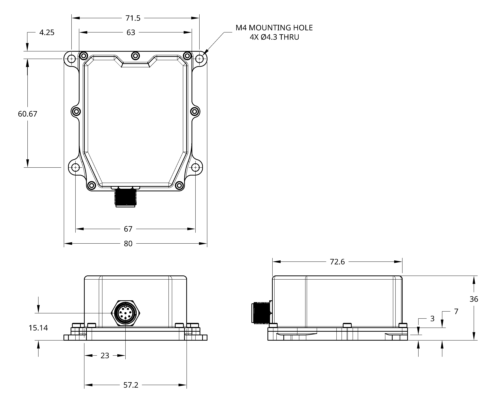
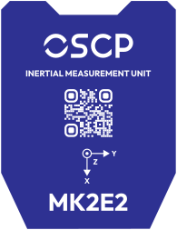

# MK2E2

!!! info "Revision"
    This documentation tracks **REV10** (2026-08-21) and is preliminary — content is
    subject to change without notice. See the [changelog](changelog.md) for revision
    history.

Our most versatile 11 degrees of freedom (DoF) unit — an IMU pairing a precision
optical gyroscope on the heading axis with three MEMS gyroscope axes, three
accelerometer axes, three TMR magnetometer axes and two inclinometer axes. The optical
gyroscope enhances stability, making the MK2E2 exceptionally resilient to thermal
drift, mechanical vibrations and EMI.

{ .fit .transparent }

**Applications**{ .specs-group }

Autonomous heavy machinery · Precision agriculture · Construction · Aerospace · Defense · UAVs · Marine

---

## Features

-   :material-axis-z-rotate-clockwise: __Precision optical gyroscope__

    On the heading axis (z) · 0.03 °/√hr ARW

-   :material-rotate-3d-variant: __Low-drift MEMS gyroscopes__

    0.5 °/hr in-run bias stability

-   :material-arrow-expand-all: __Low-drift accelerometers__

    < 15 μg in-run bias stability

-   :material-connection: __Interface__

    RS-422 or CAN-FD

-   :material-flash-outline: __Power__

    2 W · +12 to +34 VDC

-   :material-cube-outline: __Dimensions__

    78 × 63 × 36 mm[^1] · 230 g

-   :material-thermometer: __Environment__

    −40 °C to +85 °C · IP57 · IP67 coming

---

## Functional Block Diagram

{ .svg }

---

## Specifications

!!! info "Indicative figures only"
    Values below are at typical operating conditions. Test conditions, min/max limits over temperature, scale factor and non-linearity errors are given in the full specification sheet — contact us at [info@oscp.com](mailto:info@oscp.com) to request it.

**Optical Gyroscope (z-axis)**{ .specs-group }

Dynamic Range
:   ±250 °/sec

In-Run Bias Stability
:   0.5 to < 1.0 °/hr

Angle Random Walk
:   0.03 °/√hr

!!! note "Automatic z-axis source switching"
    The z-axis gyroscope output is sourced from the optical gyroscope while the
    measured rotation rate stays below 250 °/sec. Above that threshold the output
    switches automatically to the MEMS gyroscope, maintaining accuracy up to the
    selected dynamic range. No configuration or host-side handling is required.

**MEMS Gyroscopes**{ .specs-group }

Dynamic Range (Selectable)
:   ±125 to ±4000 °/sec

In-Run Bias Stability
:   0.5 to < 1.0 °/hr

Angle Random Walk
:   0.06 °/√hr

**Accelerometers**{ .specs-group }

Dynamic Range (Selectable)
:   ±2, ±4, ±8, ±16 g

In-Run Bias Stability
:   < 15 µg

Velocity Random Walk
:   0.008 m/sec/√hr

**Magnetometers & Inclinometers**{ .specs-group }

Magnetometer Dynamic Range
:   ±20 G

Inclinometer Dynamic Range (Selectable)
:   ±0.5, ±1, ±2, ±3 g

**Communications**{ .specs-group }

Protocol
:   RS-422 or CAN-FD

Output Data Rate
:   up to 500 Hz

**Electrical**{ .specs-group }

Operating Voltage
:   12 to 34 V

Power Consumption
:   2 W

**Mechanical**{ .specs-group }

Operating Temperature
:   −40 to +85 °C

Rating
:   IP57 (IP67 in certification)

Dimensions
:   78 × 63 × 36 mm[^1]

Weight
:   230 g

!!! warning "Important"
    All specifications are no longer guaranteed if the unit is opened.

---

## Certifications & Environmental Testing

The MK2E2 has been validated by an independent ISO/IEC 17025 accredited laboratory.

**Ingress Protection**{ .specs-group }

Rating
:   IP57 — IEC 60529:2019 (IP67 in process)

**Electromagnetic Compatibility**{ .specs-group }

Emissions
:   EN 55032 Class A · FCC Part 15 · ICES-003

Immunity
:   EN 55035 / CISPR 35

**Vibration & Shock**{ .specs-group }

Sine sweep
:   20–2000 Hz up to 8 g peak, all three axes

Shock
:   Half-sine up to 40 g peak, 11 ms, all three axes

!!! info "About vibration and shock"
    Units were tested unpowered and verified functional afterwards. These figures
    describe what the unit survives, not its performance during exposure.

---

## Mechanical Drawings

The enclosure features M4 mounting holes, with mechanical drawings showing the mounting through-holes and side views indicating the connector location. All units are given in mm.

<figure markdown="span">
  
</figure>

---

## Marking

The top of the package is marked with a decal indicating the orientation axes of the unit.

<figure markdown="span">
  { .transparent }
</figure>

[^1]: The width is slightly enlarged by the addition of a base to accommodate the mounting through-holes at the bottom of the IMU, for a total dimension of 78 × 80 × 36 mm.