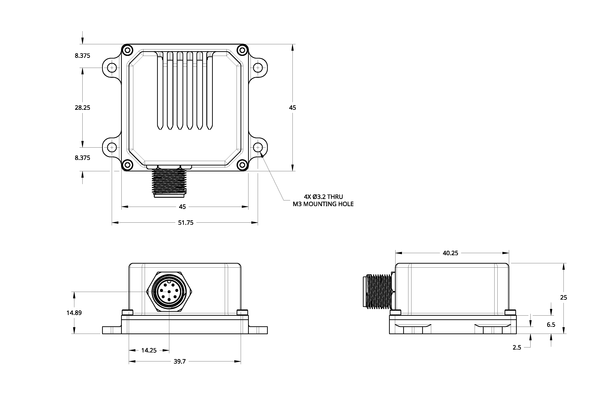
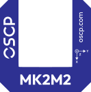

# MK2M2
 
!!! info "Revision"
    This documentation tracks **REV10** (2026-08-21) and is preliminary — content is
    subject to change without notice. See the [changelog](changelog.md) for revision
    history.

Our most compact 11 degrees of freedom (DoF) unit — a MEMS-based IMU combining three
gyroscope axes, three accelerometer axes, three TMR magnetometer axes and two
inclinometer axes in a compact enclosure. The gyroscope design improves fault
tolerance and compensates for sensor drift over time, holding angular rate accuracy in
demanding or harsh conditions.

{ .fit .transparent }

**Applications**{ .specs-group }

Small drones · Robotics · Autonomous rail · Geospatial mapping

---

## Features

-   :material-rotate-3d-variant: __Low-drift gyroscopes__

    0.5 °/hr in-run bias stability

-   :material-arrow-expand-all: __Low-drift accelerometers__

    < 15 μg in-run bias stability

-   :material-connection: __Interface__

    RS-422 or CAN-FD

-   :material-flash-outline: __Power__

    1.2 W · +12 to +34 VDC

-   :material-cube-outline: __Dimensions__

    40 × 40 × 25 mm[^1] · 75 g

-   :material-thermometer: __Environment__

    −40 °C to +85 °C · IP67

---

## Functional Block Diagram 
  
{ .svg }

---

## Specifications 

!!! info "Indicative figures only"
    Values below are at typical operating conditions. Test conditions, min/max limits over temperature, scale factor and non-linearity errors are given in the full specification sheet — contact us at [info@oscp.com](mailto:info@oscp.com) to request it.

**Gyroscopes**{ .specs-group }

Dynamic Range (Selectable)
:   ±125 to ±4000 °/sec

In-Run Bias Stability
:   0.5 to < 1.0 °/hr

Angle Random Walk
:   0.06 °/√hr

**Accelerometers**{ .specs-group }

Dynamic Range (Selectable)
:   ±2, ±4, ±8, ±16 g

In-Run Bias Stability
:   < 15 µg

Velocity Random Walk
:   0.008 m/sec/√hr

**Magnetometers & Inclinometers**{ .specs-group }

Magnetometer Dynamic Range
:   ±20 G

Inclinometer Dynamic Range (Selectable)
:   ±0.5, ±1, ±2, ±3 g

**Communications**{ .specs-group }

Protocol
:   RS-422 or CAN-FD

Output Data Rate
:   up to 500 Hz

**Electrical**{ .specs-group }

Operating Voltage
:   12 to 34 V

Power Consumption
:   1.2 W

**Mechanical**{ .specs-group }

Operating Temperature
:   −40 to +85 °C

Rating
:   IP67

Dimensions 
:   40 × 40 × 25 mm[^1]

Weight
:   75 g

!!! warning "Important"
    All specifications are no longer guaranteed if the unit is opened.

---

## Certifications & Environmental Testing

The MK2M2 has been validated by an independent ISO/IEC 17025 accredited laboratory.

**Ingress Protection**{ .specs-group }

Rating
:   IP67 — IEC 60529:2019

**Electromagnetic Compatibility**{ .specs-group }

Emissions
:   EN 55032 Class A · FCC Part 15 · ICES-003

Immunity
:   EN 55035 / CISPR 35

**Vibration & Shock**{ .specs-group }

Sine sweep
:   20–2000 Hz up to 8 g peak, all three axes

Shock
:   Half-sine up to 40 g peak, 11 ms, all three axes

!!! info "About vibration and shock"
    Units were tested unpowered and verified functional afterwards. These figures
    describe what the unit survives, not its performance during exposure.
---

## Mechanical Drawings  
The enclosure features M3 mounting holes, with mechanical drawings showing the mounting through-holes and side views indicating the connector location. All units are given in <small>mm</small>.

<figure markdown="span">
  
</figure>

??? info "Previous M2 Revision"
    For reference, a previous enclosure version was manufactured with M2 mounting holes. This earlier version had the same overall dimensions, with a slightly different distance between the centers of the smaller mounting holes. This version is no longer in production, but the corresponding mechanical drawings are available on request.

---

## Marking

The top of the package is marked with a decal indicating the orientation axes of the unit.

<figure markdown="span">
  { .transparent }
</figure>

[^1]: The standard version of the IMU has a footprint of 40 x 40 x 25 mm. To accommodate mounting through-holes, the enclosure includes a base that slightly enlarges the footprint to 45 x 58.5 x 25 mm.