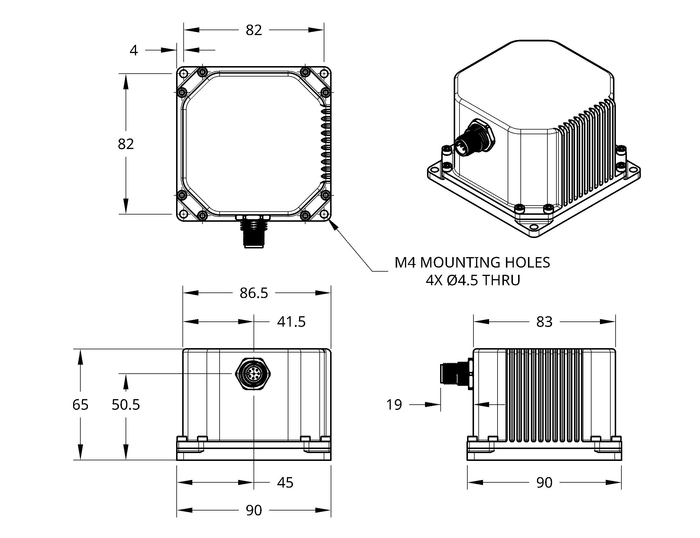
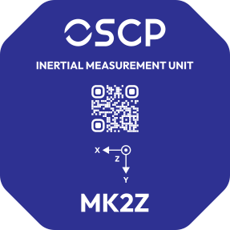

# MK2Z [PROTOTYPE]

!!! info "Revision"
    This documentation tracks **REV03** (2026-08-21) and is preliminary — content is subject to change without notice. See the [changelog](changelog.md) for revision history.

!!! warning "Prototype"
    The MK2Z is at prototype stage. Specifications are based on an initial batch of prototype units and might change.

Our highest-performance 11 degrees of freedom (DoF) unit — an IMU built around a
navigation-grade optical gyroscope on the heading axis, paired with three MEMS
gyroscope axes, three accelerometer axes, three TMR magnetometer axes and two
inclinometer axes. The optical architecture significantly enhances long-term heading
stability and drift performance, with strong resilience to thermal drift, vibration
and EMI.

{ .fit .transparent }

**Applications**{ .specs-group }

Autonomous heavy machinery · Precision agriculture · Construction · Aerospace · Defense · UAVs · Marine

---

## Features

-   :material-axis-z-rotate-clockwise: __Navigation-grade optical gyroscope__

    On the heading axis (z) · 0.005 °/hr bias

-   :material-rotate-3d-variant: __Low-drift MEMS gyroscopes__

    0.5 °/hr in-run bias stability

-   :material-arrow-expand-all: __Low-drift accelerometers__

    < 15 μg in-run bias stability

-   :material-connection: __Interface__

    RS-422 or CAN-FD

-   :material-flash-outline: __Power__

    4.5 W typical · +12 to +34 VDC

-   :material-cube-outline: __Dimensions__

    83 × 86.5 × 65 mm[^1] · 475 g

-   :material-thermometer: __Environment__

    −40 °C to +70 °C · IP67 in progress

---

## Functional Block Diagram

{ .svg }

---

## Specifications

!!! info "Indicative figures only"
    Values below are at typical operating conditions. Test conditions, min/max limits over temperature, scale factor and non-linearity errors are given in the full specification sheet — contact us at [info@oscp.com](mailto:info@oscp.com) to request it.

**Optical Gyroscope (z-axis)**{ .specs-group }

Dynamic Range
:   ±250 °/sec

In-Run Bias Stability
:   0.005 to < 0.01 °/hr

Angle Random Walk
:   0.02 to 0.03 °/√hr

!!! note "Automatic z-axis source switching"
    The z-axis gyroscope output is sourced from the optical gyroscope while the measured rotation rate stays below 250 °/sec. Above that threshold the output switches automatically to the MEMS gyroscope, maintaining accuracy up to selected range. No configuration or host-side handling is required.

**MEMS Gyroscopes**{ .specs-group }

Dynamic Range (Factory Option)
:   ±125 to ±4000 °/sec

In-Run Bias Stability
:   0.5 to < 1.0 °/hr

Angle Random Walk
:   0.06 °/√hr

**Accelerometers**{ .specs-group }

Dynamic Range (Factory Option)
:   ±2, ±4, ±8, ±16 g

In-Run Bias Stability
:   < 15 µg

Velocity Random Walk
:   0.008 m/sec/√hr

**Magnetometers & Inclinometers**{ .specs-group }

Magnetometer Dynamic Range
:   ±20 G

Inclinometer Dynamic Range (Selectable)
:   ±0.5, ±1, ±2, ±3 g

**Communications**{ .specs-group }

Protocol
:   RS-422 or CAN-FD

Output Data Rate
:   up to 500 Hz

**Electrical**{ .specs-group }

Operating Voltage
:   12 to 34 V

Power Consumption
:   4.5 W typical · 7.5 W max

**Mechanical**{ .specs-group }

Operating Temperature
:   −40 to +70 °C

Rating
:   IP67 in progress

Dimensions
:   83 × 86.5 × 65 mm[^1]

Weight
:   475 g

!!! warning "Important"
    All specifications are no longer guaranteed if the unit is opened.

---

## Mechanical Drawings

Mechanical drawings of the enclosure with the mounting through-holes, and side views showing the connector location. All units are given in mm.

<figure markdown="span">
  
</figure>

---

## Marking

The top of the package is marked with a decal indicating the orientation axes of the unit.

<figure markdown="span">
  { .transparent }
</figure>

[^1]: The width is slightly enlarged by the addition of a base to accommodate the mounting through-holes at the bottom of the IMU, for a total dimension of 90 × 90 × 65 mm.