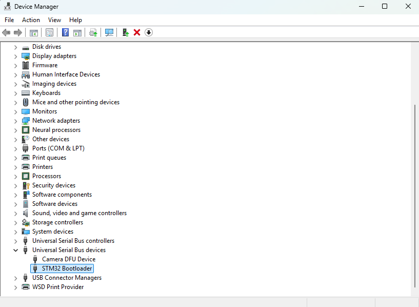
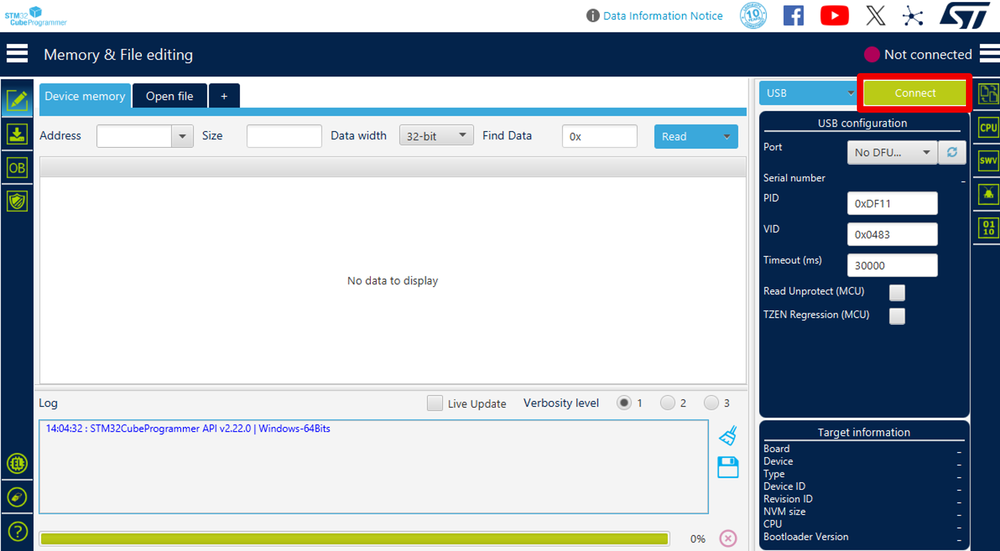
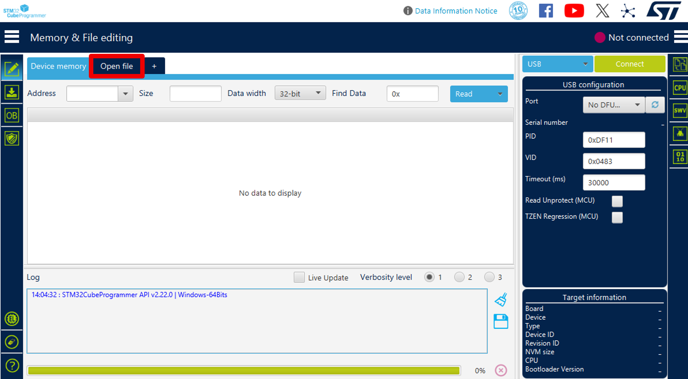
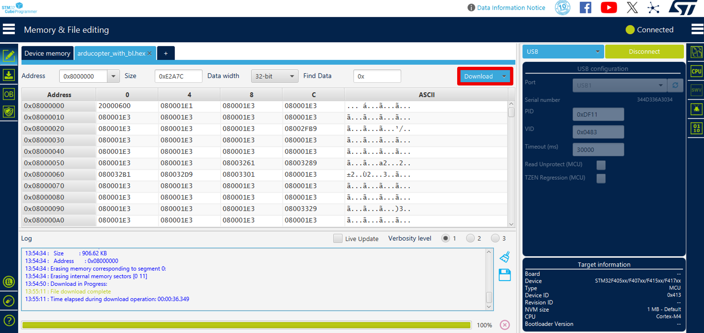
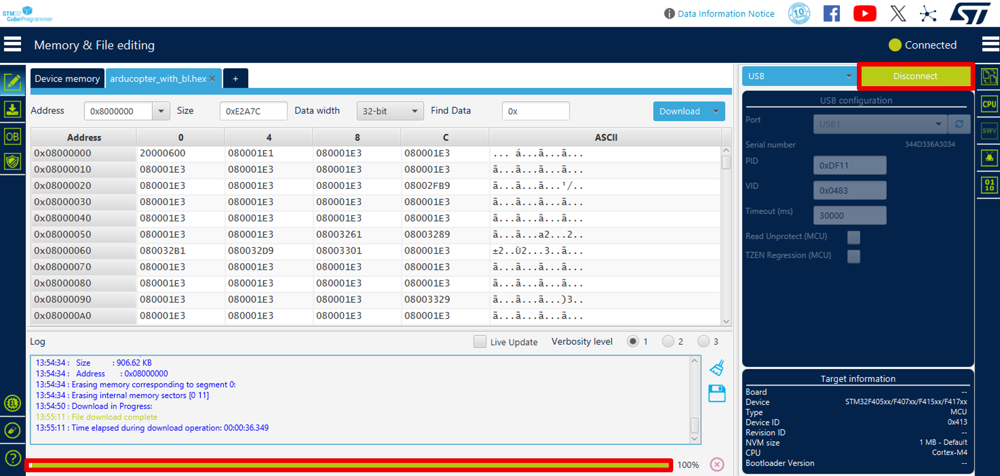
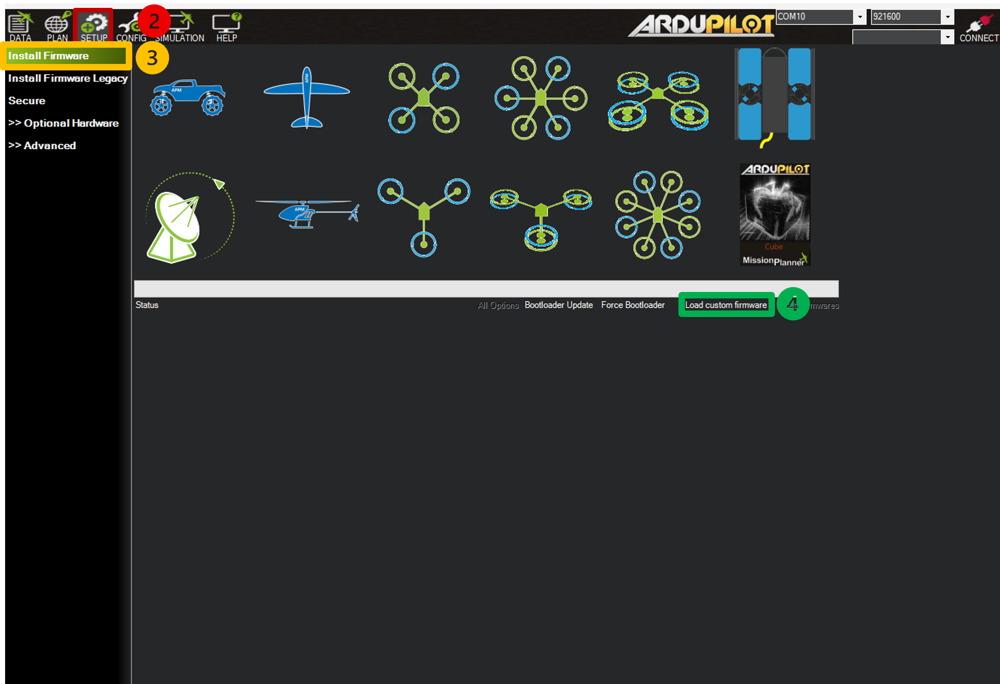

# Installation

Build, compile, and flash ArduPilot firmware with [OSCP IMU Products](https://www.oscp.com/technology){:target="_blank"} on Linux or Windows.

---

### Development Environment

This integration is developed and tested on the following tools and platforms:

<div class="grid cards" markdown>

-   [__:material-linux: Ubuntu 22.04__](https://ubuntu.com/download/desktop){:target="_blank"}
    -
    Recommended development and build environment host used for compiling and testing firmware.
-   [__:material-git: Git__](https://git-scm.com){:target="_blank"}
    -
    Source code version control and repository management.
-   [__:material-chip: ARM GNU Toolchain__](https://developer.arm.com/tools-and-software/open-source-software/developer-tools/gnu-toolchain){:target="_blank"}
    -
    GCC-based toolchain for compiling ARM firmware.
-   [__:material-usb: STM32CubeProgrammer__](https://www.st.com/en/development-tools/stm32cubeprog.html){:target="_blank"}
    -
    Firmware deployment tool for STM32-based flight controllers.
-   [__:material-quadcopter: Mission Planner__](https://ardupilot.org/planner/docs/mission-planner-installation.html){:target="_blank"}
    -
    Ground control station for configuration and flight management.
-   [__:material-serial-port: OSCP IMU Hardware__](https://www.oscp.com/technology){:target="_blank"}
    -
    External IMU sensor unit for integration testing.

</div>

### Prerequisites

=== "Linux"

    !!! note "Ubuntu Installation"
        This guide targets Ubuntu 22.04 LTS (Jammy Jellyfish). Download the Desktop image from the official Ubuntu releases page and install natively.
    
        [Download Ubuntu 22.04.5 LTS Desktop](https://releases.ubuntu.com/22.04/){:target="_blank"}

    Update your package lists and install Git:

    ```bash
    sudo apt-get update
    sudo apt-get install git
    sudo apt-get install gitk git-gui
    ```

=== "Windows"

    !!! note "WSL Installation"
        This guide targets Ubuntu 22.04 LTS (Jammy Jellyfish). Install WSL with an Ubuntu 22.04 LTS distribution via the command line.

      Install the WSL distribution with the following command:

    ```powershell
    wsl --install -d Ubuntu-22.04
    ```

    Restart your computer when prompted.

    After restarting, launch __Ubuntu__ from the Start Menu and complete the initial setup by creating a Linux username and password.

    Verify that WSL is installed successfully:

    ```powershell
    wsl --status
    ```

    Once Ubuntu has opened, update the package lists and install Git:

    ```bash
    sudo apt-get update
    sudo apt-get install git
    sudo apt-get install gitk git-gui
    ```

Clone the OSCP ArduPilot repository with required submodules:

```bash
git clone --recurse-submodules https://github.com/OSCPS/oscp_ardupilot.git
cd oscp_ardupilot
```

Install the ArduPilot build dependencies:

```bash
Tools/environment_install/install-prereqs-ubuntu.sh -y
. ~/.profile
```

Restart your terminal or run:

```bash
source ~/.profile
```

---

## Hardware Configuration

To ensure proper integration, the External AHRS (__OSCP IMU__) backend must be explicitly enabled in your flight controller's hardware definition.

!!! important "Board Flash Size"
    These steps apply regardless of your board's flash size. Boards with __1 MB__ of flash have some features disabled by default to save flash.

    The defines below ensure the OSCP backend remains compiled in, but you may need to disable other features to save flash for the External AHRS driver on __1 MB__ boards.


1. Navigate to your target flight controller board's hardware definition directory:

```text
    libraries/AP_HAL_ChibiOS/hwdef/<BOARD_NAME>
```

!!! tip "Board Name"
      Use the directory path corresponding to your actual target flight controller board.

      ```bash
      libraries/AP_HAL_ChibiOS/hwdef/Pixhawk6C-bdshot
      ```

2. Open the board's `hwdef.dat` file.

3. Append the following configuration block to the end of the file:

```bash
    #------------------------------------------------
    # External AHRS — OSCP IMU
    #------------------------------------------------
    define AP_EXTERNAL_AHRS_ENABLED 1
    define AP_EXTERNAL_AHRS_BACKEND_DEFAULT_ENABLED 1
    define AP_EXTERNAL_AHRS_OSCP_ENABLED 1
    define AP_AHRS_ENABLED 1
    define HAL_EXTERNAL_AHRS_DEFAULT 15

    # EKF3 & External Navigation Support
    define HAL_NAVEKF3_AVAILABLE 1
    define EK3_FEATURE_EXTERNAL_NAV 1
```

---

## Build the OSCP Custom Firmware

Configure the build for your target flight controller:

```bash
./waf configure --board <BOARD_NAME>
```

!!! tip "Board Name"
      Use the directory path corresponding to your actual target flight controller board.

      ```bash
      ./waf configure --board Pixhawk6C-bdshot
      ```

Build the OSCP firmware (ArduCopter shown below):

```bash
./waf copter
```

!!! note "Build Cleanup"
    Standard builds are the default and recommended workflow. Use `./waf clean` only if you encounter build issues or switch between development branches. For a full reset, use `./waf distclean`.

The generated OSCP firmware will be located in:

```text
build/<BOARD_NAME>/bin/
```

!!! tip "Board Name"
      Use the directory path corresponding to your actual target flight controller board and username.

      ```bash
      ../oscp_ardupilot/build/Pixhawk6C-bdshot/bin/arducopter.apj
      ```

---

## Flash the OSCP Custom Firmware

The following table outlines the appropriate flashing method based on the flight controller board's bootloader status.

| Board State | Bootloader | Firmware File | Flashing Tool |
|--------------|:----------:|---------------|---------------|
| Already runs<br>ArduPilot | ✅ | `arducopter.apj` | Mission Planner |
| New board | ❌ | `arducopter_with_bl.hex` | Mission Planner<br> & STM32CubeProgrammer |
| Corrupted<br>bootloader | ⚠️ | `arducopter_with_bl.hex` | Mission Planner<br> & STM32CubeProgrammer |

!!! note "Why `_with_bl.hex`?"
    This file contains both the ArduPilot bootloader and the firmware, allowing you to install both in a single flash operation.

---

<script>
function openTab(tabName) {
  // Find all tab labels generated by MkDocs
  const labels = document.querySelectorAll('.tabbed-labels label, .tabbed-set label');
  for (const label of labels) {
    if (label.textContent.trim() === tabName) {
      label.click();
      // Smoothly scroll the new tab area into view
      label.scrollIntoView({ behavior: 'smooth', block: 'start' });
      break;
    }
  }
}
</script>

=== "STM32CubeProgrammer"

    !!! note "When you need this"
        Use this path only if the board has <u>no ArduPilot bootloader</u> or if the existing bootloader is <u>corrupted</u> and the board is no longer recognized by Mission Planner. This uses the STM32 ROM-level DFU bootloader and not the ArduPilot bootloader.

    Enter STM32 DFU mode to flash the `_with_bl.hex` file. Refer to your flight controller hardware instructions for the specific DFU entry procedure.

    === "Linux"

        Install `dfu-util` if not already available:

        ```bash
        sudo apt-get install dfu-util
        ```

        Verify the board has entered DFU mode:

        ```bash
        dfu-util --list
        ```

        Check the kernel log for USB device detection.

    === "Windows"

        Open __Device Manager__

        Expand __Universal Serial Bus devices__

        Confirm the board appears as __STM32 BOOTLOADER__

        

    !!! warning
        If the device does not appear in either environment, disconnect the board and repeat/diagnose the DFU entry procedure.

    __Flash using STM32CubeProgrammer:__

    1. Open STM32CubeProgrammer.
    2. Click __Connect__  to display the flight controller information.

        

    3. Select __Open file__ to locate the `arducopter_with_bl.hex` file:

        

        ```
        build/<BOARD_NAME>/bin/arducopter_with_bl.hex
        ```

        !!! tip "Board Name"
            Use the directory path corresponding to your actual target flight controller board.

            ```bash
            /home/username/ardupilot/build/pixhawk6c-bdshot/bin/arducopter_with_bl.hex
            ```

    4. Press __Download__ to flash the image.

         
        
    5. Wait until the progress bar reaches __100%__ as this indicates the firmware has been successfully installed.
    6. Disconnect the software and proceed to <a href="#" onclick="openTab('Mission Planner'); return false;">Mission Planner</a>.
    
        
        
        !!! warning "Action Required: Complete Firmware Installation"
            Flashing via STM32CubeProgrammer only installs the bootloader. To complete the installation, you must switch to the [Mission Planner](#){: onclick="openTab('Mission Planner'); return false;" } tab and upload the custom `.apj` firmware.


=== "Mission Planner"

    !!! note "When you need this"
        Use this path for routine firmware updates on a board that already has ArduPilot installed. This flashes over the existing ArduPilot bootloader, so no DFU mode is needed.

    === "Linux"

        !!! warning "Installing Mission Planner on Linux"
            Mission Planner is designed for Windows. While Mono provides a way to run it on Linux, you may experience minor bugs. For a more reliable experience, consider using Windows.

        1. Install the latest version of __Mono__:
        ```bash
        sudo apt install mono-complete
        ```

        2. Download __Mission Planner__ as a zip file from the [here](https://ardupilot.org/planner/docs/mission-planner-installation.html#mission-planner-on-linux){:target="_blank"}.

        3. Unzip the downloaded file to a directory.

        4. Change to that directory and launch Mission Planner:
        ```bash
        cd /path/to/missionplanner/
        mono MissionPlanner.exe
        ```

    === "Windows"

        !!! note "Installing Mission Planner on Windows"
            Download the latest installer from [here](https://ardupilot.org/planner/docs/mission-planner-installation.html){:target="_blank"}.

    __Flash using Mission Planner:__

    1. Open Mission Planner.
    2. Navigate to __Setup__ to access firmware installation options.
    3. Select __Install Firmware__ to open the firmware selection screen.
    4. Click __Load Custom Firmware__ to browse for your custom `.apj` firmware file.

        

    5. Browse to the generated firmware:

        ```
        build/<BOARD_NAME>/bin/arducopter.apj
        ```

        !!! tip "Board Name"
            Use the directory path corresponding to your actual target flight controller board.

            ```bash
            /home/username/ardupilot/build/pixhawk6c-bdshot/bin/arducopter.hex
            ```

    6. Select the file and allow Mission Planner to complete the upload.
    7. Reboot the flight controller once flashing is complete.

        !!! tip "Successful Reboot"
            Disconnect and reconnect the flight controller to ensure a successful reboot.

---

!!! success "Next Steps"
    Continue to [Initialization](launch.md) for instructions on connecting and configuring your OSCP IMU in Mission Planner.

---