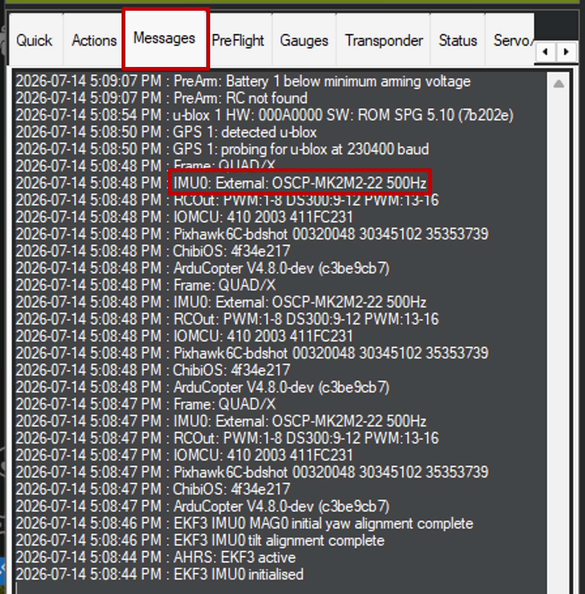
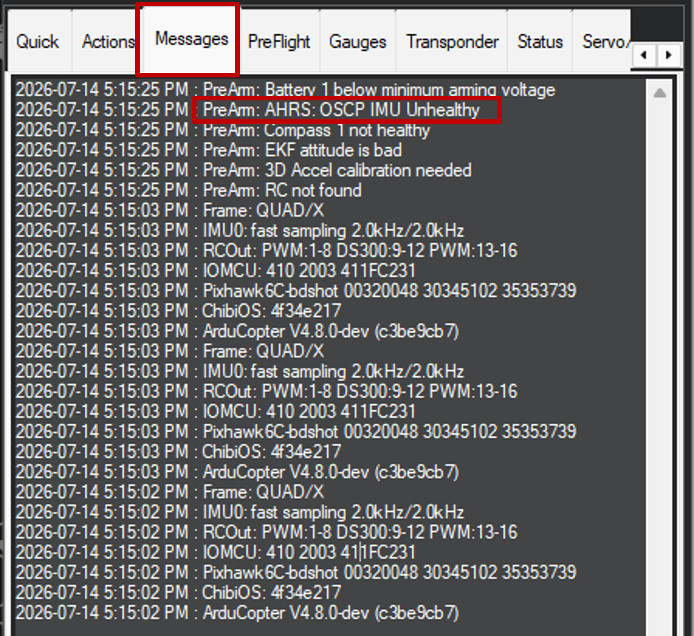

# Full Parameter List

Apply the following parameters in [Mission Planner](https://ardupilot.org/planner/){:target="_blank"} to enable [OSCP IMU Product](https://www.oscp.com/technology){:target="_blank"} support and establish communication between the flight controller and IMU product.

---

!!! warning "Important"
    Ensure the `SERIALx_*` parameters correspond to the UART port connected to the __OSCP IMU__ via __InertialGate__, __MicroGate__, or a custom USB adapter. Replace `x` with the appropriate serial port number (e.g., `SERIAL1`, `SERIAL2`, `SERIAL3`).

!!! tip "OSCP ExternalAHRS Setup"
    Ensure `EAHRS_TYPE = 15` is set to enable the OSCP IMU External AHRS backend.

---

## Full Parameter List

Set the following parameters in Mission Planner to enable OSCP IMU support and establish proper communication with the external sensor.

| Parameter | Value | Comment |
|:----------|:-----:|:--------|
| `AHRS_ORIENTATION` | 12 | <a href="#" onclick="toggleParam('ahrs-orientation'); return false;">Board Rotation</a> |
| `ARMING_SKIPCHK` | 1048062 | <a href="#" onclick="toggleParam('arming-skipchk'); return false;" style="color: #e62922;">Skip Arming Checks</a> |
| `COMPASS_EXTERNAL` | 2 | <a href="#" onclick="toggleParam('compass-external'); return false;">External compass</a> |
| `COMPASS_USE1` | 1 | <a href="#" onclick="toggleParam('compass-use1'); return false;">Enable Primary Compass</a> |
| `COMPASS_USE2, COMPASS_USE3, etc.` | 0 | <a href="#" onclick="toggleParam('compass-use-others'); return false;">Disable Additional Compasses</a> |
| `EAHRS_RATE` | 500 | <a href="#" onclick="toggleParam('eahrs-rate'); return false;">External AHRS Rate</a> |
| `EAHRS_SENSORS` | 10 | <a href="#" onclick="toggleParam('eahrs-sensors'); return false;">Sensor Mask</a> |
| `EAHRS_TYPE` | 15 | <a href="#" onclick="toggleParam('eahrs-type'); return false;">OSCP IMU</a> |
| `EK3_IMU_MASK` | 1 | <a href="#" onclick="toggleParam('ek3-imu-mask'); return false;">Primary IMU</a> |
| `INS_ENABLE_MASK` | 1 | <a href="#" onclick="toggleParam('ins-enable-mask'); return false;">Enable Primary IMU</a> |
| `INS_USE` | 1 | <a href="#" onclick="toggleParam('ins-use'); return false;">Use Primary IMU</a> |
| `INS_USE2, INS_USE3, etc.` | 0 | <a href="#" onclick="toggleParam('ins-use-others'); return false;">Disable Additional IMUs</a> |
| `SERIALx_BAUD` | 921 | <a href="#" onclick="toggleParam('serial-baud'); return false;">921600 Baud</a> |
| `SERIALx_OPTIONS` | 0 | <a href="#" onclick="toggleParam('serial-options'); return false;">Default Options</a> |
| `SERIALx_PROTOCOL` | 36 | <a href="#" onclick="toggleParam('serial-protocol'); return false;">OSCP Protocol</a> |

---

### Parameter Details

!!! info "ArduPilot Parameter Reference"
    The parameters listed below are specific to OSCP IMU integration. For a complete list of all ArduPilot parameters, refer to the [official ArduPilot parameter documentation](https://ardupilot.org/rover/docs/parameters.html){:target="_blank"}.

AHRS_ORIENTATION — Board Rotation

Sets the orientation of the flight controller. Value <code>12</code> corresponds to a specific board rotation <b>(PITCH180)</b>.

ARMING_SKIPCHK — Skip Arming Checks

Skips arming checks during development. Value <code>1048062</code> bypasses <b>ALL</b> pre-arm checks.

!!!warning "Arming Skip Check"
    Please use with caution and only for testing purposes. Disable with `0` once back to normal operation.

COMPASS_EXTERNAL — External Compass

Enables external compass support. Value <code>2</code> indicates the compass is external to the flight controller.

COMPASS_USE1 — Enable Primary Compass

Enables the OSCP compass (compass 1).

COMPASS_USE2, COMPASS_USE3, etc. — Disable Additional Compasses

Disables all other compasses (2, 3, etc.) to avoid conflicts with the OSCP IMU compass. 

EAHRS_RATE — External AHRS Rate

Sets the request rate for the external AHRS system. <code>500</code> Hz provides fast sensor fusion and responsive flight characteristics.

EAHRS_SENSORS — Sensor Mask

Enables specific sensors for the external AHRS. Value <code>10</code> enables IMU and Barometer integration.

EAHRS_TYPE — OSCP IMU

Selects the external AHRS backend. Value <code>15</code> is the OSCP IMU driver.

EK3_IMU_MASK — Primary IMU

Specifies which IMU the EKF3 estimator should use. Value <code>1</code> selects IMU 1 <b>(OSCP)</b> as the primary source.

INS_ENABLE_MASK — Enable Primary IMU

Enables the primary IMU for the inertial navigation system. Value <code>1</code> enables IMU 1 <b>(OSCP)</b>.

INS_USE — Use primary IMU

Specifies which IMU to use for attitude and position estimation. Value <code>1</code> selects IMU 1.

INS_USE2, INS_USE3, etc. — Disable Additional IMUs

Disables other IMUs (2, 3, etc.) to ensure the flight controller only uses the OSCP IMU.

SERIALx_BAUD — 921600 Baud

Sets the baud rate for the serial port. Value <code>921</code> represents 921600 baud — the required speed for OSCP IMU communication.

SERIALx_OPTIONS — Default Options

Default serial options. Value <code>0</code> means no special options enabled.

SERIALx_PROTOCOL — OSCP Protocol

Selects the protocol for the serial port. Value <code>36</code> is the OSCP IMU protocol.

---

## Verify the Installation

Connect your target flight controller with the OSCP IMU to Mission Planner, then verify the IMU is detected and initializes without errors.

??? success "Successful Installation"
    The firmware boots successfully and the OSCP External AHRS driver and IMU Product initialize without errors.
    
    

??? failure "Unsuccessful Installation"
    Either the flight controller will never connect to Mission Planner, or if it does connect, the OSCP IMU is not detected. This is typically caused by a serial connection issue, the IMU not being powered, incorrect [Full Parameter List](setup.md) configurations, or the flight controller not being configured properly in `.hwdef`.
    
    

---

!!! success ":material-rocket-launch: Configuration Complete"
    Your OSCP IMU is now configured and ready for operation.
    
    For more OSCP IMU products, visit [www.oscp.com/technology](https://www.oscp.com/technology){:target="_blank"}.
---